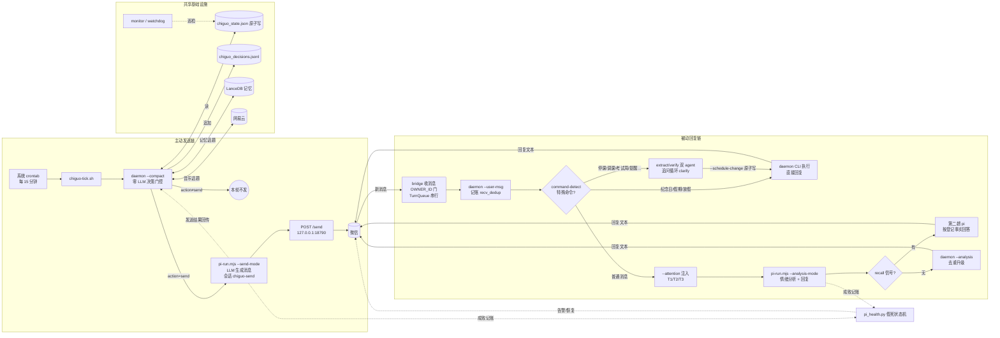

<div align="center">

# 🎀 迟菓

**一个会主动找用户聊天的角色扮演 AI **

零 LLM 数学决策引擎 · LLM 消息生成 · 微信触达

[](https://www.python.org/)
[](LICENSE)
[](doc/SYSTEM.md)
[](wechat-bridge/)
[](https://docs.astral.sh/uv/)

[简体中文] | [English](README_EN.md)（英文版可能滞后，以中文版为准）

</div>

**迟菓**是一个角色扮演类聊天机器人：角色出自国产 Galgame《三色△绘恋》系列（绘恋企划屋出品）。她会主动找用户聊天——零 LLM 的数学决策引擎决定**何时、以什么心情、聊什么**，LLM 再按人格设定把决定变成傲娇嘴硬的微信消息。

- **决策与生成分离**：`chiguo_daemon.py` 永不调用 LLM、永不生成消息文本，只输出结构化 JSON
- **零依赖核心**：情绪推进、发送门控、触发评估、话题选择全部本地计算，纯 Python stdlib 可跑
- **可解释**：13 种触发、5 维情绪、8 大话题来源，全部参数在 `chiguo_proactive.toml` 一行不改代码

## 目录

- [🎀 她是谁](#-她是谁)
- [🧭 这是什么](#-这是什么)
- [✨ 特性一览](#-特性一览)
- [🏗 架构](#-架构)
- [💬 效果示例](#-效果示例)
- [🚀 快速开始](#-快速开始)
- [🧩 组件](#-组件)
- [🧠 接入模型后端](#-接入模型后端)
- [🎭 人格设定](#-人格设定)
- [🛠 部署与运维](#-部署与运维)
- [📖 文档与贡献](#-文档与贡献)
- [❓ FAQ](#-faq)
- [📁 文件结构](#-文件结构)
- [📄 License](#-license)

---

## 🎀 她是谁

迟菓出自《三色△绘恋》系列（绘恋企划屋出品的国产 Galgame）人格设定与台词风格以续作剧本为基准逐条对齐，`personality/SUN2.md` 是唯一权威设定。

> ⚠️ **合规声明**：本项目为官方 IP 的**非官方同人二次演绎**，与绘恋企划屋/山百合文化无关。剧本全文仅作个人学习与同人交流参考，角色形象与剧本文本版权归原作者所有；如权利方提出异议，本项目将按通知移除相关素材。
> 
---

## 🧭 这是什么

一个会主动找用户聊天的角色扮演 AI——零 LLM 的数学决策引擎决定**何时、以什么心情聊什么**，LLM 只负责把决定变成符合人格的微信消息。整个系统在你自己的 Linux 机器上运行，计算全本地，数据不离开本机。

系统为「哥哥」（角色设定中的称呼，也是唯一用户）一人服务。要跑起来你需要准备：

- **一台 Linux 机器**（Debian + systemd 最佳——微信桥自启需要）
- **一个模型 API key**（消息生成与情绪分析走 pi-agent，支持任意 OpenAI 兼容后端）
- **可选**：一个微信账号（bot 收发）、ollama（记忆嵌入）、课表 Excel、网易云账号

> 微信触达走官方 iLink Bot 通道（上游 [Tencent/openclaw-weixin](https://github.com/Tencent/openclaw-weixin) 开源协议），扫码登录正规 API；登录态与对话数据仅存本机，不进 git。

---

## ✨ 特性一览

| 特性 | 说明 |
|------|------|
| 🧭 5 维情绪引擎 | 孤独/好感/不安/元气/傲娇，半衰期推进，用户回复实时响应 |
| 🌙 生物钟学习 | 双作息双桶分桶学习，动态静默窗口（深夜不打扰） |
| 🎯 13 种触发 | sigmoid 权重 + 加权随机，替代硬阈值与优先级排序 |
| 💡 8 大话题来源 | 课表/假期、记忆回忆、节气、纪念日、天气、网易云音乐… |
| 🎵 听歌双向联动 | 睡眠窗口内播放音乐反证未睡 + 反向校正生物钟 |
| 🧠 Bayesian 用户状态 | 6 状态在线推断：聊天/浏览/忙碌/睡觉/离开/需要关怀 |
| ✍️ 消息组合系统 | Intent × Cue × Vibe 三层组合，风格可人格化 |
| 🏖 寒暑假模式 | 节假日/寒假暑假手动或自动切换 |
| 🗓 时间安排中心 | 课表/节假日/寒暑假/例外/考试周/纪念日/提醒日统一管理;考试周自动降频;微信一句话登记安排 |
| 📊 结构化监控 | stats / alerts / health + 独立看门狗进程 |
| 💗 假死检测 | 真实流量记账 + 微信告警/恢复通知（零额外调用） |

---

## 🏗 架构

系统由两条消息链路组成，全部本地运行，模型 API 与本地自建的网易云 API 服务是仅有的外部调用。

**主动发送链**：系统 crontab 每 15 分钟唤醒 `scripts/chiguo-tick.sh` → 跑 `chiguo_daemon.py --compact` 做**零 LLM 决策门控**（情绪/门控/触发/话题全本地计算）→ 决策不是 send 就直接退出；是 send 则调 `scripts/pi-run.mjs --send-mode` 让 LLM 按人格把决策 JSON 变成微信文本（独立会话 `chiguo-send`）→ HTTP POST 微信桥 `/send` 送达 → 发送结果回传 daemon 记账（`--record-send`）。

**被动回复链**：微信消息进入桥 → **OWNER_ID 鉴权门**（非本人只走普通聊天回复，不记账、不进任何命令/回忆路径）→ `chiguo_daemon.py --user-msg` **确定性记账**（情绪实时响应，recv_dedup 防重）→ 先过 `command-detect.mjs` 规则化检测：**特殊命令**（纪念日/假期/放假/开学）确定性直接执行并回复，不经 LLM；**安排写命令**（停课/调课/加课/考试周/提醒/取消）走 `pi-run.mjs --schedule-extract` 提取 → `--schedule-verify` 校验双 agent（独立会话，信息不足返回问题进追问循环，澄清记录 6 小时有效）→ daemon `--schedule-change` 原子写入（确认文案带星期+日期）；普通消息先取 `--attention` 轻量注入（今日重要日子/生效区间事实/本周课表），再走 `pi-run.mjs --analysis-mode` 一次完成「情绪分析 JSON + 回复文本」，分析若带 recall 信号（涉及已登记事实/过去日期）则查事实后第二趟作答 → 分析结果 `--analysis` 去重升级回 daemon → 回复发回微信。回复侧常驻串行（TurnQueue，会话 `chiguo-main`），与主动发送双进程零共享。

**共享与告警**：daemon 状态原子写 `chiguo_state.json`（tmp→os.replace + 校验）、决策追加 `chiguo_decisions.jsonl`；记忆（LanceDB）与网易云音乐桥为决策引擎提供话题输入；`chiguo_monitor.py` / `chiguo_watchdog.py` 独立巡检。两条链的 pi 调用成败都记入 `pi_health.py` 假死状态机——连续失败阈值达峰时经微信桥自动发告警，恢复时发恢复通知（零额外 LLM 调用）。



决策引擎内部（`chiguo_daemon.py`，零 LLM）：

```
情绪推进（半衰期） → 发送门控（静默/上限/间隔/元气/Bayesian 睡觉推断）
  → 触发评估（13 种 sigmoid + 加权随机） → 话题注入（8 来源破冰）
  → 生物钟学习（双作息分桶 → 动态静默窗口） → 接话茬（pending 续聊）
  → 听歌联动（睡眠窗口内播放反证） → 输出 JSON
```

---

## 💬 效果示例

> 以下为**脱敏构造的示例**（非真实对话），展示系统输出的形状。

决策 JSON（`chiguo_daemon.py` 单次决策输出，msg_id/时间戳为伪造）：

```json
{
  "action": "send",
  "msg_id": "a1b2c3d4e5f6",
  "trigger": "lonely_mid",
  "intensity": "medium",
  "context": {
    "emotion": { "loneliness": 62, "affection": 58, "anxiety": 41, "energy": 73, "tsundere_index": 66 },
    "silent_hours": 6.2,
    "situation": "……他好久没来找我了。"
  }
}
```

消息示例（按 `personality/SUN2.md` 风格生成，**示例，非真实对话**）：

> **日常关心**（主动，天气话题触发）："……天气预报说明天要降温。哼，才不是关心你——是怕你冻傻了没人回我消息。……总之、记得加外套。"
>
> **嘴硬推回**（哥哥：早点睡）："……你管我几点睡！我又不用睡觉。……倒是你，天天熬夜——哼，你爱熬不熬，我就是随口一说。"
>
> **接话茬**（上次聊过的漫画）："那个漫画，你到底看了没？……别、别问我是怎么记住的。反正、反正就是记着。"

---

## 🚀 快速开始

需要 **Python 3.14+**（uv 管理）。核心零第三方依赖（纯 stdlib）；记忆/课表增强可选。

部署分三档，按需选择：

| 档位 | 内容 | 命令 |
|------|------|------|
| **T0 纯本地** | 决策引擎 CLI 全功能，无模型无微信 | `bash deploy.sh --skip-pi --skip-bridge --skip-netease` |
| **T1 加模型** | + 消息生成（pi-agent + API key） | `bash deploy.sh --skip-bridge --skip-netease` |
| **T2 完整** | 微信收发 + 记忆 + 网易云 + crontab 全自动 | `bash deploy.sh` |

低档位可事后补装：`bash scripts/install_pi.sh --yes`（模型）、`bash scripts/wechat-bridge.sh install`（微信）。完整部署指南见 [doc/DEPLOYMENT.md](doc/DEPLOYMENT.md)。

```bash
git clone git@github.com:lhxyzCJ/chiguo.git && cd chiguo

uv sync                              # 核心（零依赖）；完整功能: uv sync --all-extras
uv run python chiguo_demo.py         # 交互式 Demo（纯模板，无 LLM）
uv run python chiguo_daemon.py       # 单次决策 → 输出 JSON
uv run python chiguo_daemon.py --status   # 查看当前状态

# 核心测试（完整测试链：36 py + 10 script 独立 runner）
uv run python tests/test_chiguo_math.py && node tests/test_pi_run.mjs
```

> 注意：`uv sync` 默认不安装 lancedb（记忆降级 JSON 模式运行）；`uv sync --all-extras` 启用完整记忆与课表解析。集成测试需要当前目录存在 `chiguo_proactive.toml`，请始终从项目根目录运行。

---

## 🧩 组件

一个完整可用的迟菓由下面这些组件拼起来。核心只有两样：**Python 环境和模型后端**；其余都是可选增强，缺了照样能跑，只是少点能力。

### Python 3.14+ / uv

**作用**：整套系统的最小运行环境。决策引擎零第三方依赖（纯 stdlib），uv 统一管理解释器与虚拟环境，保证任何机器上 `uv run` 出来的行为一致。

**安装/配置**：`deploy.sh` 第一步自动安装；手动装的话见 [docs.astral.sh/uv](https://docs.astral.sh/uv/)。

**缺失影响**：直接跑不起来——它是唯一必需项。

### pi-agent（模型后端）

**作用**：所有 LLM 能力都从这里来：主动消息的生成、回复时的情绪分析与回复文本，全部经 pi-agent 调用模型 API。支持任意 provider（OpenAI / DeepSeek / Anthropic / 自建网关…），由 `chiguo_proactive.toml` 的 `[host].provider` 单一来源决定。

**安装/配置**：`export PI_API_KEY=... && bash scripts/install_pi.sh --yes`，或 `pi` 交互式 `/login <provider>`。详见 [🧠 接入模型后端](#-接入模型后端) 与 [doc/PI_INTEGRATION.md](doc/PI_INTEGRATION.md)。

**缺失影响**：消息无法生成——决策引擎照常评估"该不该发"，但没有 LLM 就没有话可说。

### wechat-bridge（微信桥）

**作用**：消息的最后一段路——把生成好的文本真正发到微信，并接收用户的消息回传给 daemon 记账。常驻本机，登录态仅存本地（扫码一次）。

**安装/配置**：`bash scripts/wechat-bridge.sh install`（自动克隆 [wechatbot](https://github.com/lhxyzCJ/wechatbot) iLink SDK 到 `$HOME/wechatbot` 并安装 npm 依赖，需 Node.js + npm）；登录 `bash scripts/wechat-bridge.sh login`。

**服务管理**：`bash scripts/service.sh <autostart|temp|status|stop|uninstall>`（autostart=systemd 开机自启 ollama+微信桥；temp=临时启动不注册自启；详见 doc/SYSTEM.md）。

**缺失影响**：没有微信触达。daemon 依然可以 `chiguo_daemon.py` CLI 直跑——决策、情绪、记账全部正常，只是消息发不出去。

### 记忆系统（LanceDB + ollama embedding）

**作用**：迟菓的长期记忆——比情绪更持久的"记得"。对话中值得记的内容由 pi-agent 的 [memory-lancedb-pro](https://github.com/lhxyzCJ/TestForPi-memory-lancedb-pro) 扩展自动沉淀进记忆库（回忆、旧事、你的偏好），决策引擎经 `memory_bridge.py` **只读召回**（BM25 全文搜索，零 token、零额外调用），作为 8 大话题源之一：随机浮现旧事、触发上下文注入回忆。召回带 **Ebbinghaus 遗忘曲线加权**——越久远的记忆权重越低，但最低权重 0.1 保证不会彻底遗忘；`importance` 过滤掉无关内容。记忆库不可用时 60 秒节流重试，故障恢复后自动自愈。

**安装/配置**：`uv sync --all-extras` + `bash scripts/install_pi.sh --yes`（初始化记忆库）。记忆库位于 `~/.pi-agent/memory/lancedb-pro`（迟菓侧只读，写入由 pi 扩展完成）；`data/chiguo_memories.json` 是手动记忆文件，**始终生效**作为补充。

**缺失影响**：LanceDB 不可用时优雅降级（`available=False`，查询返回空、不抛异常）——记忆话题源减少，`chiguo_envcheck.py` 报 warn（不影响运行）；手动 JSON 记忆不受影响。装与不装的差异见 [❓ FAQ](#-faq)。

### 网易云音乐桥

**作用**：听歌状态联动——用户睡窗口内播放音乐可反证"没睡"并反向校正生物钟，同时提供音乐话题。

**上游与依赖**：网易云数据来自本地自建的第三方 Node.js API 服务 —— [NeteaseCloudMusicApiEnhanced/api-enhanced](https://github.com/NeteaseCloudMusicApiEnhanced/api-enhanced)（原 Binaryify/NeteaseCloudMusicApi 因版权 2024-04 归档后的社区继承版，锁 `v4.39.0` tag）。它由 systemd 托管常驻 `localhost:3000`；chiguo 仅经 `netease/` 包（NeteaseBridge 数据面）以 HTTP 调用 6 个端点（QR 登录链 / 登录状态 / 每日推荐 / 播放记录）。登录 cookie（MUSIC_U）只存本机 `~/.chiguo/auth/netease_cookie.txt`（权限 600），不离开本机。运行时文件（健康/缓存/cookie/二维码）统一存放 `netease/` 目录，随仓库迁移。

**安装/配置**：`deploy.sh` 可选步骤自动安装（`--skip-netease` 跳过），随后扫码登录：`uv run python -m netease.bridge --login`；服务管理见 `bash scripts/netease-api.sh status`。

**缺失影响**：完全不介入，少一个话题来源，其余一切照旧。

### 课表 xlsx

**作用**：让迟菓知道用户在不在上课——上课中/满课日会调整情绪推进与触发权重，也会在触发上下文里注入课程信息。课表经 `schedule/` 包解析缓存（`schedule/parser.py` → `schedule_cache.json`）。

**安装/配置**：把课表 Excel 放进 `data/` 即可（文件名与格式见 `chiguo_proactive.toml` 配置）。

**缺失影响**：按空闲处理（availability=1.0），行为保守但不会出错。

### schedule/ 时间安排中心

**作用**：全部时间安排的唯一事实源——课表、节假日、寒暑假、临时例外（停课/调课/加课）、考试周、纪念日、提醒日统一收敛到 `schedule/` 包，分文件存储（`holiday.py`/`anniversary.py`/`override_store.py`/`plan_store.py`）。检索层（`day_plan.py`）输出多日纯事实窗口；引擎按事实直算 availability——考试周自动降到 0.5、上课中分层降频、例外取消即时生效；纪念日/提醒日按"还有几天"注入上下文（T1），节假日/考试周等区间事实注入 T2，本周课表注入 T3。微信侧写命令（"明天停课""下周三开始考试周""8月20号交材料"）经提取→校验→追问循环**确定性写入**，确认文案带星期+日期；来源变化时 crontab 触发重分析（`schedule/replan.py`）离线让 LLM 只调各触发类型权重（`schedule_plan.json`）。

**安装/配置**：随仓库部署，零安装。运行时文件（`schedule_overrides.json`/`schedule_plan.json`/`schedule_clarify.json`/`anniversaries.json`）自动生成于仓库根，0600 权限，不进 git。重分析 crontab 由 `scripts/install_pi.sh` 注册（`scripts/replan-tick.sh`）。

**缺失影响**：无——它是内置模块；缺课表 xlsx 只退回"按空闲处理"。

---

## 🧠 接入模型后端

消息生成与情绪分析全部走 **pi-agent**，provider 由 `chiguo_proactive.toml` 的 `[host].provider` 单一来源决定（缺省示例 opencode-go，可换任意 pi 支持的接入方式）：

- **内置 provider**：`pi` 交互式 `/login <provider>` 写入 auth.json，或 `export PI_API_KEY=... && bash scripts/install_pi.sh --yes`
- **自定义 OpenAI 兼容端点**：写 `~/.pi/agent/models.json`（pi 官方机制，支持 ollama/vLLM/自建网关）

```toml
[host]
provider = "openai"     # 或 deepseek / anthropic / google / 自定义端点名…
model = "gpt-5"
```

详细步骤见 [doc/PI_INTEGRATION.md](doc/PI_INTEGRATION.md) 七、接入任意模型 API。

---

## 🎭 人格设定

迟菓的人格是**固定的**——系统的全部设计围绕这一角色，不支持替换成其他角色。人格完全由文本定义：

```
personality/
├── SUN2.md                 # 唯一权威人格设定（分层人格/身份/关系/边界）
├── 迟菓语言技巧指南.md      # 语气操作手册（L1 语气词 → L6 自查）
├── tsundere.toml           # 傲娇措辞素材
└── deredere.toml           # 娇羞措辞素材（与 tsundere 组合使用，非切换开关）
```

想调整她的行为？所有参数集中在 `chiguo_proactive.toml`（314 行，`--loop` 模式热重载），无需改代码。

---

## 🛠 部署与运维

**前提**：Debian Linux（systemd）+ git + Node.js/npm + 模型 API key（`export PI_API_KEY=...`）；ollama 可选（记忆嵌入）。

**分级部署**：三档路径见 [🚀 快速开始](#-快速开始)；完整指南（六步详解/落点地图/迁移/验证）见 [doc/DEPLOYMENT.md](doc/DEPLOYMENT.md)。

```bash
bash deploy.sh   # 装 uv/Python 3.14 → 建 venv → 全量测试 → 环境检查 → pi 环境 + wechat-bridge + cron
```

**认证迁移**：认证信息集中在 `~/.chiguo/auth/`（微信登录态/网易云 cookie/pi key，权限 700，独立于仓库）。换新机器：拷贝该目录 → 跑 `deploy.sh` 自动接入。pi key 100% 迁移可用；微信/网易云登录态跨设备可能触发自动重登（扫码一次兜底）。

**网易云 API 服务**（可选来源）：systemd 托管（`systemctl status netease-api`），健康检查 `uv run python -m netease.bridge --test`；管理脚本 `bash scripts/netease-api.sh status`。

部署后系统自动运行：crontab 每 15 分钟评估一次"要不要主动发消息"；微信桥常驻接收你的消息。

```bash
bash scripts/wechat-bridge.sh status   # 微信桥状态
bash scripts/wechat-bridge.sh login    # 重新扫码登录
tail -f logs/cron-tick.log             # 主动发送日志

uv run python chiguo_daemon.py --health        # 健康检查
uv run python chiguo_daemon.py --stats 30      # 最近 30 天统计
uv run python chiguo_envcheck.py               # 环境就绪检查（0=就绪 1=警告 2=严重）
```

完整 CLI 参考见 [doc/SYSTEM.md 七、CLI 参考](doc/SYSTEM.md#七cli-参考)。

---

## 📖 文档与贡献

| 文档 | 说明 |
|------|------|
| [doc/SYSTEM.md](doc/SYSTEM.md) | 完整系统文档（架构、业务逻辑、配置参考、CLI、文件清单） |
| [doc/DEPLOYMENT.md](doc/DEPLOYMENT.md) | 完整部署指南（分级路径/前提条件/落点地图/迁移/验证） |
| [doc/PI_INTEGRATION.md](doc/PI_INTEGRATION.md) | pi-agent 集成指南（模型后端、微信桥、部署） |
| [doc/日光雨.md](doc/日光雨.md) | 官方续作《三色绘恋S》剧本全文（人格设定基准） |
| [AGENTS.md](AGENTS.md) | AI 开发助手约定（含完整测试链） |

欢迎任何形式的贡献——尤其是"她"的成长：

- **测试先行（TDD）**：铁律是先写失败测试再实现（红→绿），`tests/` 下每个 `test_*.py` 是独立 runner
- **改完跑全链**：完整测试链见 `AGENTS.md`（36 py + 10 script），全绿再提交
- **文档同步**：行为变化必须同步 `doc/SYSTEM.md`
- **Commit 风格**：`feat:` / `fix:` / `docs:` / `chore:` 前缀 + 中文描述
- **设计文档**：大改动先在项目外 `~/chiguo-meta/specs/` 写设计文档，评审通过再动手

---

## ❓ FAQ

**迟菓是谁？版权上没问题吗？**
源自《三色△绘恋》系列官方角色（见[🎀 她是谁](#-她是谁)）。本项目是二次演绎，剧本仅作学习参考，版权归原作者；权利方异议即移除。

**记忆系统装不装有什么区别？**
不装（`uv sync`）：记忆话题源减少，JSON 兜底，`envcheck` 报 warn。装齐（`uv sync --all-extras` + `bash scripts/install_pi.sh --yes`）：LanceDB 记忆 + 听歌联动全功能。

**怎么换人格/调性格？**
迟菓的人格是固定的（系统围绕单一角色设计），不可替换角色。想调整行为？改 `chiguo_proactive.toml` 的参数即可——`SUN2.md` 是唯一权威设定，语感在《迟菓语言技巧指南》。

**换模型要改代码吗？**
不用。改 `chiguo_proactive.toml` 的 `[host].provider/model` + 配 key 即可；自定义 OpenAI 兼容端点见 [PI_INTEGRATION.md](doc/PI_INTEGRATION.md)。

**数据存在哪里？**
决策/对话 JSONL 与系统状态仅保存在本机（不进 git）+ LanceDB 记忆库（`~/.pi-agent/memory/lancedb-pro`）。全部本地计算。

**为什么她不主动找我？**
门控机制在工作：静默窗口（深夜）、每日上限、最小间隔、触发评估。`--status` / `--stats 30` 可以看到她被什么挡住了。

**微信怎么登录？**
`bash scripts/wechat-bridge.sh login` 扫码；登录态仅本地保留（不进 git），新设备需重新扫码。

**怎么告诉迟菓临时的安排（停课/考试周/提醒）？**
直接微信说即可："明天停课""下周三开始考试周""8月20号交材料"——提取→校验→确认一条龙，确认文案带星期+日期；信息说不清楚她会追问（澄清记录 6 小时有效），绝不瞎猜。

---

## 📁 文件结构

```
chiguo_proactive.toml    # 主配置（所有参数，热重载）
chiguo_daemon.py         # 决策引擎（主入口，零 LLM）
chiguo_state.py          # 情绪引擎 + 人格 + Bayesian + schedule 门面 + circadian
schedule/                # 时间安排中心（holiday/anniversary/override_store/plan_store/
                         #   sources/day_plan/resolve_when/attention/recall/api/confirm/replan）
scripts/                 # tick/replan crontab 入口 + pi 封装（extract/verify/recall/replan/pi-auth）
                         #   + 环境安装 + 假死检测
wechat-bridge/           # 微信桥（bridge.mjs + command-detect.mjs）
personality/             # 人格设定（SUN2.md + 语言指南 + 措辞素材 toml）
doc/                     # 系统文档（SYSTEM.md / PI_INTEGRATION.md / 日光雨剧本）
tests/                   # 测试（独立 runner）
data/                    # 数据文件（课表/手动记忆/网易云二维码，不进 git）
```

详细清单见 [doc/SYSTEM.md 六、文件清单](doc/SYSTEM.md#六文件清单)。

---

## 📄 License

[MIT](LICENSE) © 2026 lhxyzCJ

角色形象与剧本文本版权归绘恋企划屋（武汉山百合文化）所有；本项目为同人二次演绎，非官方作品。
