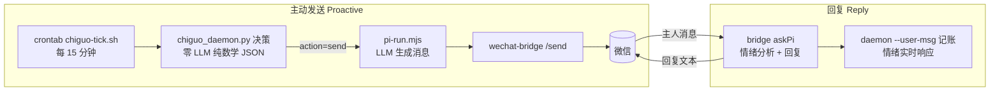

# 迟菓主动消息系统 (Chiguo)

**简体中文** | [English](README_EN.md)

> English 版可能滞后于中文版，本文件（中文版）为准。*The English version may lag behind; this Chinese version is authoritative.*

> 一个会主动找主人聊天的 AI 角色 —— 数学驱动的决策引擎 + LLM 消息生成，微信触达。
> A proactive AI companion: a zero-LLM math decision engine decides *when* and *what mood* to talk, an LLM turns that into WeChat messages.

**迟菓**是一套"角色主动消息"系统：由零 LLM 的数学决策引擎（`chiguo_daemon.py`）基于**情绪模型、生物钟学习、触发评估、话题注入**等机制决定"何时、以什么心情、聊什么"，输出结构化 JSON；再由 pi-agent 读取 JSON 生成拟人消息并通过微信发送。

*Chiguo is a proactive-messaging system for an AI character: a pure math engine (no LLM) decides when to reach out and what to say, then an LLM backend (pi-agent) turns the decision into a natural WeChat message.*

- **决策与生成分离**：daemon 永不调用 LLM、永不生成消息文本，只输出 JSON
- **零依赖核心**：情绪推进、发送门控、触发评估、话题选择全部本地计算，纯 Python stdlib 可跑
- **可解释**：13 种触发类型、5 维情绪、8 大话题来源，全部参数可在 `chiguo_proactive.toml` 调整

## 目录 / Table of Contents

- [定位与边界 / Positioning](#定位与边界--positioning)
- [迟菓的由来 / The Origin of Chiguo](#迟菓的由来--the-origin-of-chiguo)
- [特性一览 / Features](#特性一览--features)
- [架构 / Architecture](#架构--architecture)
- [效果示例 / Example Outputs](#效果示例--example-outputs)
- [快速开始 / Quick Start](#快速开始--quick-start)
- [接入自己的模型后端 / Bring Your Own Model](#接入自己的模型后端--bring-your-own-model)
- [配置 / Configuration](#配置--configuration)
- [自定义人格 / Customizing the Persona](#自定义人格--customizing-the-persona)
- [部署为线上服务 / Deploy as a Live Service](#部署为线上服务--deploy-as-a-live-service)
- [文件结构 / Project Layout](#文件结构--project-layout)
- [CLI 参考 / CLI Reference](#cli-参考--cli-reference)
- [常见问题 / FAQ](#常见问题--faq)
- [贡献 / Contributing](#贡献--contributing)
- [文档 / Documentation](#文档--documentation)
- [License](#license)

---

## 定位与边界 / Positioning

迟菓是一个**个人项目、开源分享、持续演进**的作品：作者自己每天都在用，功能按自己的需求生长，代码可能因为个人习惯而不那么"工程化"。它不是商业产品，没有 SLA，也不承诺 API 稳定。如果它让你产生"我也想养一个赛博角色"的想法，那就是这个项目最大的意义。


### 组件依赖 / Component Dependencies

| 组件 | 必需性 | 缺失时的降级 |
|------|--------|--------------|
| Python 3.14+ / uv | 必需 | — |
| pi-agent（模型后端，任意 provider） | 必需 | 消息无法生成 |
| wechat-bridge（微信桥） | 可选 | 无微信触达，daemon 仍可 CLI 直跑 |
| 记忆系统（pi 扩展 memory-lancedb-pro + LanceDB 库 + ollama embedding + Python `lancedb` 包） | 可选 | 记忆话题源减少（JSON 兜底），`envcheck` 报 warn |
| 网易云音乐桥 | 可选 | 音乐话题源与听歌反证不可用 |
| 课表 xlsx | 可选 | 上课状态降级为 availability=0.85 |

> ⚠️ **隐私说明**：微信登录态（`wechat-bridge/credentials/`）、真实对话日志（`chiguo_messages.jsonl`/`chiguo_decisions.jsonl`）与个人数据（`data/` 课表/记忆/二维码）**均不进入 git**（本地保留，历史已重写清除）——公开仓库无需清理。
>
> **隐私实话**：你的对话与系统状态数据仅保存在本机（不进 git、不推送远端）；仓库只含代码、配置与文档。数据全部本地计算，不经过任何第三方云服务（模型 API 与网易云接口调用除外）。

---

## 迟菓的由来 / The Origin of Chiguo

迟菓出自绘恋企划屋（武汉山百合文化）的国产 Galgame《三色△绘恋》（Tricolour Lovestory）系列：

- **初登场**：《三色绘恋》（2017，Steam）——她是迟耀的妹妹，初三在读的傲娇少女。
- **主角化**：官方续作《三色绘恋S》（SunnyRain Lovestory，2020）——"师贰高附近初中的女学生，课余时间靠送外卖补贴家用，人称'打工妹'"。
- **本项目**：她在现代世界的另一种可能——搬进一台 VPS 的赛博身体，每天惦记着哥哥什么时候回消息。


人格设定与台词风格以续作剧本《日光雨》（仓库内 `doc/日光雨.md`，17099 行）为基准逐条对齐，`personality/SUN2.md` 是唯一权威设定。

**合规声明**：本项目为官方 IP 的二次演绎，**非官方作品**，与绘恋企划屋/山百合文化无关。剧本全文随仓库附送，仅作个人学习与同人交流参考；角色形象与剧本文本版权归原作者所有。如权利方提出异议，本项目将按通知移除相关素材。

---

## 特性一览 / Features

| 特性 | 说明 |
|------|------|
| 5 维情绪引擎 | 孤独/好感/不安/元气/傲娇，半衰期推进，主人回复实时响应 |
| 生物钟学习 | 双作息双桶分桶学习，动态静默窗口（深夜不打扰） |
| 13 种触发 | sigmoid 权重 + 加权随机，替代硬阈值与优先级排序 |
| 8 大话题来源 | 课表/假期、记忆回忆、节气、纪念日、天气、网易云音乐… |
| 听歌双向联动 | 睡眠窗口内播放音乐反证未睡 + 反向校正生物钟 |
| Bayesian 用户状态 | 6 状态在线推断：聊天/浏览/忙碌/睡觉/离开/需要关怀 |
| 消息组合系统 | Intent × Cue × Vibe 三层组合，风格可人格化 |
| 寒暑假模式 | 节假日 / 寒假暑假手动或自动切换 |
| 结构化监控 | stats / alerts / health + 独立看门狗进程 |
| pi 假死检测 | 真实流量记账 + 微信告警/恢复通知（零额外调用） |


---

## 架构 / Architecture

两条链路：**主动发送**（daemon 决策 → pi 生成 → 微信发送）与**回复**（微信消息 → pi 分析+回复 → daemon 记账）。



决策引擎内部（`chiguo_daemon.py`，零 LLM）：

```
chiguo_daemon.py（决策引擎）
  ├─ 情绪推进（半衰期衰减）
  ├─ 发送门控（静默/上限/间隔/元气/Bayesian 睡觉推断）
  ├─ 触发评估（13 种 sigmoid 权重 + 加权随机）
  ├─ 话题注入（8 来源破冰）
  ├─ 生物钟学习（circadian：双作息双桶分桶学习 → 动态静默窗口）
  ├─ 接话茬（follow_up：pending 话题续聊）
  ├─ 听歌双向联动（netease：睡眠窗口内播放反证 sleeping）
  └─ 输出 JSON → pi-agent 生成消息 → wechat-bridge → 微信发送
```

---

## 效果示例 / Example Outputs

以下为**脱敏构造的示例**（非真实对话），展示系统输出的形状。

决策 JSON（`chiguo_daemon.py` 单次决策输出，msg_id/时间戳为伪造）：

```json
{
  "action": "send",
  "msg_id": "a1b2c3d4e5f6",
  "trigger": "lonely_mid",
  "intensity": "medium",
  "context": {
    "emotion": { "loneliness": 62, "affection": 58, "anxiety": 41, "energy": 73, "tsundere_index": 66 },
    "silent_hours": 6.2,
    "situation": "……他好久没来找我了。"
  }
}
```

消息示例（按 `personality/SUN2.md` 风格生成，**示例，非真实对话**）：

> **日常关心**（主动，天气话题触发）："……天气预报说明天要降温。哼，才不是关心你——是怕你冻傻了没人回我消息。……总之、记得加外套。"
>
> **嘴硬推回**（哥哥：早点睡）："……你管我几点睡！我又不用睡觉。……倒是你，天天熬夜——哼，你爱熬不熬，我就是随口一说。"
>
> **接话茬**（上次聊过的漫画）："那个漫画，你到底看了没？……别、别问我是怎么记住的。反正、反正就是记着。"

---

## 快速开始 / Quick Start

需要 **Python 3.14+**（uv 管理）。核心零第三方依赖（纯 stdlib）；记忆/课表增强可选。

```bash
git clone <仓库地址> && cd <仓库目录>

uv sync                              # 核心（零依赖）；完整功能: uv sync --all-extras
uv run python chiguo_demo.py         # 交互式 Demo（纯模板，无 LLM）
uv run python chiguo_daemon.py       # 单次决策 → 输出 JSON
uv run python chiguo_daemon.py --status   # 查看当前状态

# 核心测试（完整测试链见 AGENTS.md：24 个 py + 9 个脚本独立 runner）
uv run python test_chiguo_math.py && node test_pi_run.mjs
```

> 注意：`uv sync` 默认不安装 lancedb（记忆降级 JSON 模式运行）；`uv sync --all-extras` 启用完整记忆与课表解析。集成测试需要当前目录存在 `chiguo_proactive.toml`，请始终从项目根目录运行。

---

## 接入自己的模型后端 / Bring Your Own Model

消息生成与情绪分析全部走 **pi-agent**，provider 由 `chiguo_proactive.toml` 的 `[host].provider` 单一来源决定（缺省示例 opencode-go，可换任意 pi 支持的接入方式）：

- **内置 provider**：`pi` 交互式 `/login <provider>` 写入 auth.json，或 `export PI_API_KEY=... && bash scripts/install_pi.sh --yes`
- **自定义 OpenAI 兼容端点**：写 `~/.pi/agent/models.json`（pi 官方机制，支持 ollama/vLLM/自建网关）

```toml
[host]
provider = "openai"     # 或 deepseek / anthropic / google / 自定义端点名…
model = "gpt-5"
```

详细步骤见 [doc/PI_INTEGRATION.md](doc/PI_INTEGRATION.md) 七、接入任意模型 API。

---

## 配置 / Configuration

所有参数集中在 `chiguo_proactive.toml`（314 行，热重载于 `--loop` 模式），无需改代码：

```toml
[emotion]       # 5 维情绪：孤独/好感/不安/元气/傲娇（半衰期推进）
[cooldown]      # 发送门控：静默窗口/每日上限/最小间隔
[trigger]       # 13 种触发 sigmoid 权重
[topic_picker]  # 8 大话题来源与权重
[composer]      # 消息组合 Intent × Cue × Vibe
[host]          # pi-agent 后端：provider/model/thinking/session
[health]        # pi 假死检测阈值
```

完整配置参考见 [doc/SYSTEM.md](doc/SYSTEM.md)。

---

## 自定义人格 / Customizing the Persona

这是本项目最好玩的部分——人格完全由文本定义，可以整个换掉：

```
personality/
├── SUN2.md                 # 唯一权威人格设定（分层人格/身份/关系/边界）
├── 迟菓语言技巧指南.md      # 语气操作手册（L1 语气词 → L6 自查）
├── tsundere.toml           # 傲娇档位（当前人格）
└── deredere.toml           # 娇羞档位（可切换）
```

想换角色？写一份自己的 `SUN2.md`（参考现有结构），把 `[host].personality_dir` 指过去即可。

---

## 部署为线上服务 / Deploy as a Live Service

```bash
bash deploy.sh   # 装 uv/Python 3.14 → 建 venv → 全量测试 → 环境检查 → pi 环境安装 + wechat-bridge + cron 注册
```

**认证迁移**：认证信息集中在 `~/.chiguo/auth/`（微信登录态 / 网易云 cookie / pi key，权限 700，独立于仓库）。换新机器：拷贝该目录 → 跑 `deploy.sh` 自动接入。pi key 100% 迁移可用；微信/网易云登录态跨设备可能触发自动重登（扫码一次兜底）。

部署后系统自动运行：crontab 每 15 分钟评估一次"要不要主动发消息"；微信桥常驻接收你的消息。管理命令：

```bash
bash scripts/wechat-bridge.sh status   # 微信桥状态
bash scripts/wechat-bridge.sh login    # 重新扫码登录
tail -f logs/cron-tick.log             # 主动发送日志
```

---

## 文件结构 / Project Layout

```
chiguo_proactive.toml    # 主配置（所有参数）
chiguo_daemon.py         # 决策引擎（主入口，零 LLM）
chiguo_state.py          # 情绪引擎 + 人格 + Bayesian + 课表 + 节假日 + 记忆 + circadian
chiguo_circadian.py      # 生物钟学习（双作息分桶）
chiguo_trigger.py        # 触发器（sigmoid 权重 + 加权随机 + follow_up）
chiguo_topics.py         # 话题选择器（8 来源 + Ebbinghaus + 人格调制）
chiguo_math.py           # 数学库（sigmoid/半衰期/Hawkes/概率累积）
chiguo_personality.py    # 多维人格系统（Big Five + 角色特有 8 维）
chiguo_bayesian.py       # Bayesian 用户状态推断（6 状态在线学习）
chiguo_composer.py       # 消息组合系统（Intent × Cue × Vibe）
chiguo_eventbus.py       # 轻量事件总线
netease_bridge.py        # 网易云桥接（最近播放 + 缓存 + 有限重试）
chiguo_netease.py        # 网易云策略层（健康/降级链/配额/话题素材）
schedule_parser.py       # 课表解析（xskb.xlsx → cache）
holiday_parser.py        # 节假日判断
solar_terms.py           # 24 节气查询
memory_bridge.py         # LanceDB 只读桥接 + Ebbinghaus 遗忘（lancedb 可选，缺了降级 JSON）
anniversary_manager.py   # 纪念日/倒计时 CRUD
chiguo_monitor.py        # 结构化监控（stats / alerts / health）
chiguo_watchdog.py       # 独立看门狗（停滞检测）
chiguo_envcheck.py       # 环境就绪检查（只读）
chiguo_version.py        # 项目版本号单一来源（每轮修改 +0.1）
chiguo_demo.py           # 演示模式（纯模板）
scripts/pi_health.py     # pi 假死状态机（真实流量记账 + 微信告警）
scripts/pi-run.mjs       # pi 调用统一封装（生成/分析）
scripts/chiguo-tick.sh   # 系统 crontab 入口（主动发送链路）
scripts/install_pi.sh    # pi 环境安装器（dry-run/yes/ask，幂等）
wechat-bridge/           # 微信桥（bridge.mjs + command-detect.mjs）
personality/             # 人格设定（SUN2.md + 语言指南 + 档位 toml）
doc/                     # 系统文档（SYSTEM.md / PI_INTEGRATION.md / 日光雨剧本）
test_*.py / test_*.mjs / test_*.sh   # 测试（独立 runner）
data/                    # 数据文件（课表/手动记忆/网易云二维码）
```

---

## CLI 参考 / CLI Reference

```bash
# 决策引擎
uv run python chiguo_daemon.py                  # 单次决策
uv run python chiguo_daemon.py --status         # 查看状态
uv run python chiguo_daemon.py --compact        # 紧凑模式（tick 用）
uv run python chiguo_daemon.py --version        # 版本号
uv run python chiguo_daemon.py --loop 120       # 持续运行

# 主人消息
uv run python chiguo_daemon.py --user-msg "消息"
uv run python chiguo_daemon.py --user-msg "消息" --analysis '{"warmth":0.7,"effort":0.8,"attention":0.9}'

# 纪念日管理
uv run python chiguo_daemon.py --anniversary "add anniversary 11-03 主人生日"
uv run python chiguo_daemon.py --anniversary "add countdown 2026-12-25 考试"
uv run python chiguo_daemon.py --anniversary list

# 寒暑假模式
uv run python chiguo_daemon.py --break add 2026-01-12 2026-02-22 寒假
uv run python chiguo_daemon.py --break on / off / status

# 健康检查 & 监控
uv run python chiguo_daemon.py --health
uv run python chiguo_daemon.py --stats 30
uv run python chiguo_monitor.py --summary --health
uv run python chiguo_watchdog.py --quiet         # 看门狗（退出码驱动）

# 环境就绪检查（只读）
uv run python chiguo_envcheck.py                # 退出码 0=就绪 1=警告 2=严重
```

---

## 常见问题 / FAQ

**迟菓是谁？版权上没问题吗？**
源自《三色绘恋》系列官方角色（见[迟菓的由来](#迟菓的由来--the-origin-of-chiguo)）。本项目是二次演绎，剧本随仓库附送仅作学习参考，版权归原作者；权利方异议即移除。

**记忆系统装不装有什么区别？**
不装（`uv sync`）：记忆话题源减少，JSON 兜底，`envcheck` 报 warn。装齐（`uv sync --all-extras` + `bash scripts/install_pi.sh --yes`）：LanceDB 记忆 + 听歌联动全功能。

**怎么换人格/调性格？**
改 `personality/` 目录即可——`SUN2.md` 是权威设定，语感在《迟菓语言技巧指南》，整体换个角色也只需新写一份 SUN2.md。

**换模型要改代码吗？**
不用。改 `chiguo_proactive.toml` 的 `[host].provider/model` + 配 key 即可；自定义 OpenAI 兼容端点见 [PI_INTEGRATION.md](doc/PI_INTEGRATION.md)。

**数据存在哪里？**
决策/对话 JSONL 与系统状态仅保存在本机（不进 git）+ LanceDB 记忆库（`~/.pi-agent/memory/lancedb-pro`）。全部本地计算。

**为什么她不主动找我？**
门控机制在工作：静默窗口（深夜）、每日上限、最小间隔、触发评估。`--status` / `--stats 30` 可以看到她被什么挡住了。

**微信怎么登录？**
`bash scripts/wechat-bridge.sh login` 扫码；登录态仅本地保留（不进 git），新设备需重新扫码。

---

## 贡献 / Contributing

欢迎任何形式的贡献——尤其是"她"的成长：

- **测试先行（TDD）**：本项目铁律是先写失败测试再实现（红→绿）。每个 `test_*.py` 是独立 runner，退出码驱动。
- **改完跑全链**：完整测试链见 `AGENTS.md`（24 个 py + 9 个脚本测试），全绿再提交。
- **文档同步**：任何行为变化必须同步 `doc/SYSTEM.md`、`doc/IMPROVE.md`、`MEMORY.md`（仓库铁律）。
- **Commit 风格**：`feat:` / `fix:` / `docs:` / `chore:` 前缀 + 中文描述。
- **设计文档**：大改动先在项目外 `~/chiguo-meta/specs/` 写设计文档，评审通过再动手。

---

## 文档 / Documentation

- [doc/SYSTEM.md](doc/SYSTEM.md) — 完整系统文档（架构、业务逻辑、配置参考）
- [doc/PI_INTEGRATION.md](doc/PI_INTEGRATION.md) — pi-agent 集成指南（模型后端、微信桥、部署）
- [doc/日光雨.md](doc/日光雨.md) — 官方续作《三色绘恋S》剧本全文（人格设定基准）
- [doc/IMPROVE.md](doc/IMPROVE.md) — 改进清单
- [doc/README.md](doc/README.md) — 内部部署速查（本机运维）
- [AGENTS.md](AGENTS.md) / [CLAUDE.md](CLAUDE.md) — AI 开发助手约定（含完整测试链）

---

## License

[MIT](LICENSE) © 2026 lhxyzCJ

角色形象与剧本文本版权归绘恋企划屋（武汉山百合文化）所有；本项目为同人二次演绎，非官方作品。
