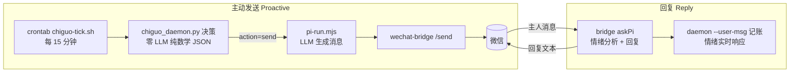

<div align="center">

# 🎀 迟菓

**一个会主动找主人聊天的角色扮演 AI 妹妹**

零 LLM 数学决策引擎 · LLM 消息生成 · 微信触达

[](https://www.python.org/)
[](LICENSE)
[](doc/SYSTEM.md)
[](wechat-bridge/)
[](https://docs.astral.sh/uv/)

[简体中文] | [English](README_EN.md)（英文版可能滞后，以中文版为准）

</div>

**迟菓**是一个角色扮演类聊天机器人：角色出自国产 Galgame《三色△绘恋》系列（绘恋企划屋出品）。她会主动找主人聊天——零 LLM 的数学决策引擎决定**何时、以什么心情、聊什么**，LLM 再按人格设定把决定变成傲娇嘴硬的微信消息。

- **决策与生成分离**：`chiguo_daemon.py` 永不调用 LLM、永不生成消息文本，只输出结构化 JSON
- **零依赖核心**：情绪推进、发送门控、触发评估、话题选择全部本地计算，纯 Python stdlib 可跑
- **可解释**：13 种触发、5 维情绪、8 大话题来源，全部参数在 `chiguo_proactive.toml` 一行不改代码

## 目录

- [🎀 她是谁](#-她是谁)
- [✨ 特性一览](#-特性一览)
- [🏗 架构](#-架构)
- [💬 效果示例](#-效果示例)
- [🚀 快速开始](#-快速开始)
- [🧠 接入模型后端](#-接入模型后端)
- [🎭 自定义人格](#-自定义人格)
- [🛠 部署与运维](#-部署与运维)
- [📖 文档与贡献](#-文档与贡献)
- [❓ FAQ](#-faq)
- [📁 文件结构](#-文件结构)
- [📄 License](#-license)

---

## 🎀 她是谁

迟菓出自《三色△绘恋》系列（绘恋企划屋出品的国产 Galgame），在这里她搬进了一台 VPS——每天惦记着哥哥什么时候回消息。人格设定与台词风格以续作剧本为基准逐条对齐，`personality/SUN2.md` 是唯一权威设定。

> ⚠️ **合规声明**：本项目为官方 IP 的**非官方同人二次演绎**，与绘恋企划屋/山百合文化无关。剧本全文仅作个人学习与同人交流参考，角色形象与剧本文本版权归原作者所有；如权利方提出异议，本项目将按通知移除相关素材。
>
> 🔒 **隐私说明**：微信登录态、真实对话日志与个人数据（课表/记忆/二维码）**均不进 git**，只保存在本机；全部计算本地完成，不经过任何第三方云服务（模型 API 与网易云接口调用除外）。公开仓库无需清理。

### 组件依赖

| 组件 | 必需性 | 缺失时的降级 |
|------|--------|--------------|
| Python 3.14+ / uv | 必需 | — |
| pi-agent（模型后端，任意 provider） | 必需 | 消息无法生成 |
| wechat-bridge（微信桥） | 可选 | 无微信触达，daemon 仍可 CLI 直跑 |
| 记忆系统（LanceDB + ollama embedding） | 可选 | 记忆话题源减少（JSON 兜底），`envcheck` 报 warn |
| 网易云音乐桥 | 可选 | 完全不介入（话题源少 1 个） |
| 课表 xlsx | 可选 | 按空闲处理（availability=1.0） |

---

## ✨ 特性一览

| 特性 | 说明 |
|------|------|
| 🧭 5 维情绪引擎 | 孤独/好感/不安/元气/傲娇，半衰期推进，主人回复实时响应 |
| 🌙 生物钟学习 | 双作息双桶分桶学习，动态静默窗口（深夜不打扰） |
| 🎯 13 种触发 | sigmoid 权重 + 加权随机，替代硬阈值与优先级排序 |
| 💡 8 大话题来源 | 课表/假期、记忆回忆、节气、纪念日、天气、网易云音乐… |
| 🎵 听歌双向联动 | 睡眠窗口内播放音乐反证未睡 + 反向校正生物钟 |
| 🧠 Bayesian 用户状态 | 6 状态在线推断：聊天/浏览/忙碌/睡觉/离开/需要关怀 |
| ✍️ 消息组合系统 | Intent × Cue × Vibe 三层组合，风格可人格化 |
| 🏖 寒暑假模式 | 节假日/寒假暑假手动或自动切换 |
| 📊 结构化监控 | stats / alerts / health + 独立看门狗进程 |
| 💗 假死检测 | 真实流量记账 + 微信告警/恢复通知（零额外调用） |

---

## 🏗 架构

两条链路：**主动发送**（daemon 决策 → pi 生成 → 微信发送）与**回复**（微信消息 → pi 分析+回复 → daemon 记账）。



决策引擎内部（`chiguo_daemon.py`，零 LLM）：

```
情绪推进（半衰期） → 发送门控（静默/上限/间隔/元气/Bayesian 睡觉推断）
  → 触发评估（13 种 sigmoid + 加权随机） → 话题注入（8 来源破冰）
  → 生物钟学习（双作息分桶 → 动态静默窗口） → 接话茬（pending 续聊）
  → 听歌联动（睡眠窗口内播放反证） → 输出 JSON
```

---

## 💬 效果示例

> 以下为**脱敏构造的示例**（非真实对话），展示系统输出的形状。

决策 JSON（`chiguo_daemon.py` 单次决策输出，msg_id/时间戳为伪造）：

```json
{
  "action": "send",
  "msg_id": "a1b2c3d4e5f6",
  "trigger": "lonely_mid",
  "intensity": "medium",
  "context": {
    "emotion": { "loneliness": 62, "affection": 58, "anxiety": 41, "energy": 73, "tsundere_index": 66 },
    "silent_hours": 6.2,
    "situation": "……他好久没来找我了。"
  }
}
```

消息示例（按 `personality/SUN2.md` 风格生成，**示例，非真实对话**）：

> **日常关心**（主动，天气话题触发）："……天气预报说明天要降温。哼，才不是关心你——是怕你冻傻了没人回我消息。……总之、记得加外套。"
>
> **嘴硬推回**（哥哥：早点睡）："……你管我几点睡！我又不用睡觉。……倒是你，天天熬夜——哼，你爱熬不熬，我就是随口一说。"
>
> **接话茬**（上次聊过的漫画）："那个漫画，你到底看了没？……别、别问我是怎么记住的。反正、反正就是记着。"

---

## 🚀 快速开始

需要 **Python 3.14+**（uv 管理）。核心零第三方依赖（纯 stdlib）；记忆/课表增强可选。

```bash
git clone git@github.com:lhxyzCJ/chiguo.git && cd chiguo

uv sync                              # 核心（零依赖）；完整功能: uv sync --all-extras
uv run python chiguo_demo.py         # 交互式 Demo（纯模板，无 LLM）
uv run python chiguo_daemon.py       # 单次决策 → 输出 JSON
uv run python chiguo_daemon.py --status   # 查看当前状态

# 核心测试（完整测试链：24 个 py + 7 个脚本独立 runner）
uv run python tests/test_chiguo_math.py && node tests/test_pi_run.mjs
```

> 注意：`uv sync` 默认不安装 lancedb（记忆降级 JSON 模式运行）；`uv sync --all-extras` 启用完整记忆与课表解析。集成测试需要当前目录存在 `chiguo_proactive.toml`，请始终从项目根目录运行。

---

## 🧠 接入模型后端

消息生成与情绪分析全部走 **pi-agent**，provider 由 `chiguo_proactive.toml` 的 `[host].provider` 单一来源决定（缺省示例 opencode-go，可换任意 pi 支持的接入方式）：

- **内置 provider**：`pi` 交互式 `/login <provider>` 写入 auth.json，或 `export PI_API_KEY=... && bash scripts/install_pi.sh --yes`
- **自定义 OpenAI 兼容端点**：写 `~/.pi/agent/models.json`（pi 官方机制，支持 ollama/vLLM/自建网关）

```toml
[host]
provider = "openai"     # 或 deepseek / anthropic / google / 自定义端点名…
model = "gpt-5"
```

详细步骤见 [doc/PI_INTEGRATION.md](doc/PI_INTEGRATION.md) 七、接入任意模型 API。

---

## 🎭 自定义人格

这是本项目最好玩的部分——人格完全由文本定义，可以整个换掉：

```
personality/
├── SUN2.md                 # 唯一权威人格设定（分层人格/身份/关系/边界）
├── 迟菓语言技巧指南.md      # 语气操作手册（L1 语气词 → L6 自查）
├── tsundere.toml           # 傲娇档位（当前人格）
└── deredere.toml           # 娇羞档位（可切换）
```

想换角色？写一份自己的 `SUN2.md`（参考现有结构），把 `[host].personality_dir` 指过去即可。所有参数集中在 `chiguo_proactive.toml`（314 行，`--loop` 模式热重载），无需改代码。

---

## 🛠 部署与运维

```bash
bash deploy.sh   # 装 uv/Python 3.14 → 建 venv → 全量测试 → 环境检查 → pi 环境 + wechat-bridge + cron
```

**认证迁移**：认证信息集中在 `~/.chiguo/auth/`（微信登录态/网易云 cookie/pi key，权限 700，独立于仓库）。换新机器：拷贝该目录 → 跑 `deploy.sh` 自动接入。pi key 100% 迁移可用；微信/网易云登录态跨设备可能触发自动重登（扫码一次兜底）。

部署后系统自动运行：crontab 每 15 分钟评估一次"要不要主动发消息"；微信桥常驻接收你的消息。

```bash
bash scripts/wechat-bridge.sh status   # 微信桥状态
bash scripts/wechat-bridge.sh login    # 重新扫码登录
tail -f logs/cron-tick.log             # 主动发送日志

uv run python chiguo_daemon.py --health        # 健康检查
uv run python chiguo_daemon.py --stats 30      # 最近 30 天统计
uv run python chiguo_envcheck.py               # 环境就绪检查（0=就绪 1=警告 2=严重）
```

完整 CLI 参考见 [doc/SYSTEM.md 七、CLI 参考](doc/SYSTEM.md#七cli-参考)。

---

## 📖 文档与贡献

| 文档 | 说明 |
|------|------|
| [doc/SYSTEM.md](doc/SYSTEM.md) | 完整系统文档（架构、业务逻辑、配置参考、CLI、文件清单） |
| [doc/PI_INTEGRATION.md](doc/PI_INTEGRATION.md) | pi-agent 集成指南（模型后端、微信桥、部署） |
| [doc/日光雨.md](doc/日光雨.md) | 官方续作《三色绘恋S》剧本全文（人格设定基准） |
| [AGENTS.md](AGENTS.md) | AI 开发助手约定（含完整测试链） |

欢迎任何形式的贡献——尤其是"她"的成长：

- **测试先行（TDD）**：铁律是先写失败测试再实现（红→绿），每个 `test_*.py` 是独立 runner
- **改完跑全链**：完整测试链见 `AGENTS.md`（24 py + 7 脚本），全绿再提交
- **文档同步**：行为变化必须同步 `doc/SYSTEM.md`
- **Commit 风格**：`feat:` / `fix:` / `docs:` / `chore:` 前缀 + 中文描述
- **设计文档**：大改动先在项目外 `~/chiguo-meta/specs/` 写设计文档，评审通过再动手

---

## ❓ FAQ

**迟菓是谁？版权上没问题吗？**
源自《三色△绘恋》系列官方角色（见[🎀 她是谁](#-她是谁)）。本项目是二次演绎，剧本仅作学习参考，版权归原作者；权利方异议即移除。

**记忆系统装不装有什么区别？**
不装（`uv sync`）：记忆话题源减少，JSON 兜底，`envcheck` 报 warn。装齐（`uv sync --all-extras` + `bash scripts/install_pi.sh --yes`）：LanceDB 记忆 + 听歌联动全功能。

**怎么换人格/调性格？**
改 `personality/` 目录即可——`SUN2.md` 是权威设定，语感在《迟菓语言技巧指南》，整体换个角色也只需新写一份 `SUN2.md`。

**换模型要改代码吗？**
不用。改 `chiguo_proactive.toml` 的 `[host].provider/model` + 配 key 即可；自定义 OpenAI 兼容端点见 [PI_INTEGRATION.md](doc/PI_INTEGRATION.md)。

**数据存在哪里？**
决策/对话 JSONL 与系统状态仅保存在本机（不进 git）+ LanceDB 记忆库（`~/.pi-agent/memory/lancedb-pro`）。全部本地计算。

**为什么她不主动找我？**
门控机制在工作：静默窗口（深夜）、每日上限、最小间隔、触发评估。`--status` / `--stats 30` 可以看到她被什么挡住了。

**微信怎么登录？**
`bash scripts/wechat-bridge.sh login` 扫码；登录态仅本地保留（不进 git），新设备需重新扫码。

---

## 📁 文件结构

```
chiguo_proactive.toml    # 主配置（所有参数，热重载）
chiguo_daemon.py         # 决策引擎（主入口，零 LLM）
chiguo_state.py          # 情绪引擎 + 人格 + Bayesian + 课表/节假日/记忆 + circadian
scripts/                 # tick 入口 / pi 封装 / 环境安装 / 假死检测
wechat-bridge/           # 微信桥（bridge.mjs + command-detect.mjs）
personality/             # 人格设定（SUN2.md + 语言指南 + 档位 toml）
doc/                     # 系统文档（SYSTEM.md / PI_INTEGRATION.md / 日光雨剧本）
test_*.py / .mjs / .sh   # 测试（独立 runner）
data/                    # 数据文件（课表/手动记忆/网易云二维码，不进 git）
```

详细清单见 [doc/SYSTEM.md 六、文件清单](doc/SYSTEM.md#六文件清单)。

---

## 📄 License

[MIT](LICENSE) © 2026 lhxyzCJ

角色形象与剧本文本版权归绘恋企划屋（武汉山百合文化）所有；本项目为同人二次演绎，非官方作品。
