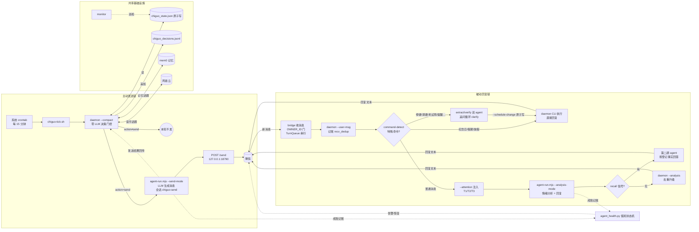

<div align="center">

# 🎀 Chiguo (迟菓)

**A role-play AI who proactively messages her user**

Zero-LLM math decision engine · LLM message generation · WeChat delivery

[](https://www.python.org/)
[](https://github.com/lhxyzCJ/chiguo/actions/workflows/ci.yml)
[](LICENSE)
[](doc/SYSTEM.md)
[](wechat-bridge/)
[](https://docs.astral.sh/uv/)

[简体中文](README.md) | **English**（The English version may lag behind; the Chinese version is authoritative.）

</div>

**Chiguo** is a role-play chat bot: a character from the Chinese galgame series *Tricolour Lovestory* (by 绘恋企划屋 / HL-Galgame). She proactively messages her user — a zero-LLM math decision engine decides *when* to reach out, *in what mood*, and *about what*; an LLM turns each decision into a tsundere WeChat message that fits her persona.

- **Decision/generation separation**: `chiguo_daemon.py` never calls an LLM and never writes message text — only structured JSON
- **Zero-dependency core**: emotion decay, send gating, trigger evaluation, and topic selection all run locally on pure Python stdlib
- **Interpretable**: 14 trigger types, 5 emotion dimensions, 8 topic sources — every parameter tunable in `chiguo_proactive.toml`, no code changes

## Table of Contents

- [🎀 Who Is She](#-who-is-she)
- [🧭 What This Is](#-what-this-is)
- [✨ Features](#-features)
- [🏗 Architecture](#-architecture)
- [💬 Example Outputs](#-example-outputs)
- [🚀 Quick Start](#-quick-start)
- [🧩 Components](#-components)
- [🧠 Bring Your Own Model](#-bring-your-own-model)
- [🎭 Persona (Fixed)](#-persona-fixed)
- [🛠 Deploy & Ops](#-deploy--ops)
- [📖 Docs & Contributing](#-docs--contributing)
- [❓ FAQ](#-faq)
- [📁 Project Layout](#-project-layout)
- [📄 License](#-license)

---

## 🎀 Who Is She

Chiguo comes from the *Tricolour Lovestory* series (a Chinese galgame by 绘恋企划屋 / HL-Galgame). Her personality and speech style are aligned line-by-line with the official sequel's script; `personality/SUN2.md` is the single authoritative persona definition.

> ⚠️ **Compliance notice**: this project is an **unofficial fan re-imagining of an official IP**, unrelated to 绘恋企划屋 / Shanybai Culture. The script text is bundled for personal study and fan-community reference only; character and script copyrights belong to the original creators. If the rights holders object, the project will remove the relevant material upon notice.

---

## 🧭 What This Is

A role-play AI that proactively messages her user — a zero-LLM math decision engine decides **when to message, in what mood, and about what**; an LLM only turns each decision into a WeChat message that fits her persona. The entire system runs on your own Linux machine — all computation is local, and data never leaves the machine.

The system serves one user only: 哥哥 (gēge, her in-character name for the user). To get it running you'll need:

- **A Linux machine** (Debian + systemd is best — the WeChat bridge autostart needs it)
- **A model API key** (message generation and mood analysis go through the agent backend — the default agent backend; any OpenAI-compatible backend works, or swap in any CLI agent via `[host].runner = command`)
- **Optional**: a WeChat account (bot send/receive), ollama (memory embeddings), a schedule Excel, a NetEase account

> WeChat delivery uses the official iLink Bot channel (upstream [Tencent/openclaw-weixin](https://github.com/Tencent/openclaw-weixin), open source); QR login via the official API. Login state and conversation data stay on your machine — nothing goes into git.

---

## ✨ Features

| Feature | Description |
|---------|-------------|
| 🧭 5-dimension emotion engine | Loneliness / affection / anxiety / energy / tsundere, half-life decay, real-time response to replies |
| 🌙 Circadian learning | Dual-schedule dual-bucket learning, dynamic quiet window (no late-night pings) |
| 🎯 14 trigger types | Sigmoid weights + weighted randomness instead of hard thresholds |
| 💡 8 topic sources | Schedule/holidays, memory recall, solar terms, anniversaries, weather, NetEase Music… |
| 🎵 Music bidirectional linkage | Playback inside the sleep window disproves "asleep" + reverse-calibrates the circadian model |
| 🧠 Bayesian user state | 6 states inferred online: chatting / browsing / busy / sleeping / away / needs care |
| ✍️ Message composer | Intent × Cue × Vibe three-layer composition, persona-able style |
| 🏖 Break/summer-winter modes | Holidays and semester breaks, manual or automatic switching |
| 🗓 Schedule center | Unified management of schedule / holidays / breaks / exceptions / exam weeks / anniversaries / reminders; exam weeks auto-lower send rate; register an arrangement with one WeChat message |
| 📊 Structured monitoring | stats / alerts / health |
| 💗 Backend liveness detection | Real-traffic accounting + WeChat alert/recovery notices (zero extra calls) |
| ⚖️ Elastic emotion engine | Elastic decay (rebounds faster the farther from equilibrium) + emotion interaction matrix + reply saturation damping + reply impact inertia |
| 🚦 Smart trigger layer | Three-stage activation + schedule multiplier + repeat damping + unreplied backoff state machine + comfort trigger |
| 🫂 User mood sensing | LLM senses the user's mood (low/distressed/happy/angry) → comfort trigger + gentler tone note (off by default, grayscale) |
| 🌊 Emotional fluctuation | OU noise simulates unexplained mood swings (off by default, grayscale) |
| 🌱 Relationship dynamics | Long-term interactions slowly shift the emotional equilibrium (baseline drift, off by default, grayscale) |
| 🛡 Deterministic fallback | agent failure → composer template fallback (zero LLM) + content-level anti-repetition |

---

## 🏗 Architecture

The system is two message pipelines, all running locally — the model API and the self-hosted NetEase API service are the only external calls.

**Proactive sending**: a system crontab wakes `scripts/chiguo-tick.sh` every 15 minutes (or resident with `CHIGUO_DAEMON_LOOP=1`, see [AGENT_INTEGRATION.md](doc/AGENT_INTEGRATION.md)) → runs `chiguo_daemon.py --compact` as a **zero-LLM decision gate** (emotion / gating / triggers / topics all computed locally) → if the decision is not `send`, it exits; otherwise `scripts/agent-run.mjs --send-mode` (agent abstraction, the agent backend by default) turns the decision JSON into WeChat text via the LLM (dedicated session `chiguo-send`) → HTTP POST to the bridge `/send` for delivery → the send result is reported back to the daemon (`--record-send`); if agent generation fails, `chiguo_composer.py` falls back to the template pool and outputs the text directly (zero LLM: still sends with a fallback flag; only if composer also fails does the tick fail).

**Passive replying**: a WeChat message enters the bridge → an **OWNER_ID gate** (non-owners only get a plain chat reply — no accounting, no command/recall paths) → `chiguo_daemon.py --user-msg` records it **deterministically** (real-time emotion response, recv_dedup against double-counting) → `command-detect.mjs` rules check first: **special commands** (anniversaries / holidays / break on-off) are executed and answered directly, **no LLM**; **schedule write-commands** (cancel / move / add / exam week / reminder / remove) go through `agent-run.mjs --schedule-extract` extraction → `--schedule-verify` verification (dual agents, separate sessions; if info is missing they return a question into the clarify loop, records valid 6h) → daemon `--schedule-change` atomic write (confirmation text carries weekday + date); ordinary messages first fetch a lightweight `--attention` injection (today's important days / active range facts / this week's schedule), then run `agent-run.mjs --analysis-mode`, producing "mood analysis JSON + reply text" in one call — if the analysis carries a recall signal (registered facts / past dates), the bridge queries the facts and answers via a second agent pass → the analysis is merged back into the daemon via `--analysis` (dedup upgrade) → the reply is sent back to WeChat. The reply side runs as a resident serial process (TurnQueue, session `chiguo-main`), zero session sharing with proactive sending.

**Shared & alerting**: daemon state is written atomically to `chiguo_state.json` (tmp→os.replace + checksum), decisions appended to `chiguo_decisions.jsonl`; memory (`[memory].backend`, mem0 by default, switchable to a custom class) and the NetEase Music bridge feed topic inputs; `chiguo_monitor.py` patrols independently. Both pipelines record agent-call outcomes into the `agent_health.py` liveness state machine — when consecutive failures cross the threshold, it alerts via the WeChat bridge automatically, and notifies on recovery (zero extra LLM calls).



Inside the decision engine (`chiguo_daemon.py`, zero LLM):

```
emotion decay (elastic + interaction matrix) → send gating (quiet window / caps / interval / energy / Bayesian sleep inference)
  → trigger evaluation (14 sigmoid + 3-stage activation / schedule multiplier / repeat damping / backoff) → topic injection (8 sources for ice-breaking)
  → circadian learning (dual-schedule buckets → dynamic quiet window) → follow-up (pending topics)
  → music linkage (playback in sleep window disproves sleeping) → JSON output
```

---

## 💬 Example Outputs

> Sanitized, fabricated examples (not real conversations), showing the shape of the system's output.

Decision JSON (single `chiguo_daemon.py` run; msg_id/timestamp are fake):

```json
{
  "action": "send",
  "msg_id": "a1b2c3d4e5f6",
  "trigger": "lonely_mid",
  "intensity": "medium",
  "context": {
    "emotion": { "loneliness": 62, "affection": 58, "anxiety": 41, "energy": 73, "tsundere_index": 66 },
    "silent_hours": 6.2,
    "situation": "…He hasn't messaged me in a while."
  }
}
```

Example messages (generated in the `personality/SUN2.md` style — **examples, not real conversations**):

> **Daily care** (proactive, weather topic triggered): "…The forecast says it's getting cold tomorrow. Hmph, it's not like I care — I just don't want you freezing your brain off and leaving my messages unread. …Anyway. Wear a jacket."
>
> **Tsundere pushback** (哥哥: "go to bed early"): "…What's it to you when I sleep! It's not like I need sleep anyway. …You're the one up till all hours — hmph, stay up then. I was just saying."
>
> **Follow-up** (about a manga they discussed): "Did you ever get around to that manga, or what? …Don't— don't ask how I remember these things. I just… do."

---

## 🚀 Quick Start

Requires **Python 3.14+** (managed by uv). The core has zero third-party dependencies (pure stdlib); memory/schedule enhancements are optional.

Deployment comes in three tiers — pick what you need:

| Tier | Contents | Command |
|------|----------|---------|
| **T0 pure local** | Full decision-engine CLI, no model, no WeChat | `bash deploy.sh --skip-agent --skip-bridge --skip-netease` |
| **T1 + model** | + message generation (agent backend + API key) | `bash deploy.sh --skip-bridge --skip-netease` |
| **T2 full** | WeChat send/receive + memory + NetEase + crontab, fully automatic | `bash deploy.sh` |

Lower tiers can be upgraded later: `bash scripts/install_agent.sh --yes` (model), `bash scripts/wechat-bridge.sh install` (WeChat). Full deployment guide: [doc/DEPLOYMENT.md](doc/DEPLOYMENT.md).

```bash
git clone https://github.com/lhxyzCJ/chiguo.git && cd chiguo   # public repo: https or ssh (git@github.com:lhxyzCJ/chiguo.git)

uv sync                              # core (mem0 memory layer required); full features: uv sync --all-extras (+schedule parsing)
uv run python chiguo_demo.py         # interactive demo (templates only, no LLM)
uv run python chiguo_daemon.py       # single decision → JSON
uv run python chiguo_daemon.py --status   # current state

# Core tests (full suite: 48 py + 13 script standalone runners)
bash scripts/ci-test.sh   # same entry point as GitHub Actions; any failure exits non-zero
```

> Note: `uv sync` installs mem0ai (the memory layer is a required dependency); `uv sync --all-extras` additionally enables schedule parsing. Integration tests require `chiguo_proactive.toml` in the current directory — always run from the project root.

---

## 🧩 Components

A complete Chiguo is assembled from the components below. Only two are essential — **Python** and the **model backend**; everything else is an optional enhancement that degrades gracefully.

### Python 3.14+ / uv

**Role**: the minimal runtime. The decision engine has zero third-party dependencies (pure stdlib); uv manages the interpreter and virtualenv so `uv run` behaves identically on any machine.

**Setup**: `deploy.sh` installs it automatically; manually: [docs.astral.sh/uv](https://docs.astral.sh/uv/).

**Missing**: nothing runs — it is the only truly required piece.

### agent backend (model backend)

**Role**: the agent backend abstraction — all LLM capabilities come from here: proactive message generation, and reply mood analysis + reply text. By default they go through the agent backend, which supports any provider (OpenAI / DeepSeek / Anthropic / self-hosted gateways…), decided by the single source `[host].provider` in `chiguo_proactive.toml`; with `[host].runner = command` you can swap in any CLI agent instead (`[host].agent_command`, unified contract `--prompt <full prompt> --mode <mode>`, JSON or NDJSON on stdout).

**Setup**: default agent mode: `export AGENT_API_KEY=... && bash scripts/install_agent.sh --yes`, or `pi` interactive `/login <provider>`; command mode just needs any executable agent. See [🧠 Bring Your Own Model](#-bring-your-own-model) and [doc/AGENT_INTEGRATION.md](doc/AGENT_INTEGRATION.md).

**Missing**: no messages can be generated — the decision engine still evaluates *whether* to send, but there is no LLM to produce the words.

### wechat-bridge (WeChat bridge)

**Role**: the last mile — actually delivers generated text to WeChat and receives the user's messages back for the daemon to record. Runs as a resident process; login state stays local (one QR scan).

**Setup**: `bash scripts/wechat-bridge.sh install` (auto-clones the [wechatbot](https://github.com/lhxyzCJ/wechatbot) iLink SDK to `$HOME/wechatbot` and installs npm dependencies — requires Node.js + npm); login with `bash scripts/wechat-bridge.sh login`.

**Service management**: `bash scripts/service.sh <autostart|temp|status|stop|uninstall>` (autostart = systemd boot autostart for ollama + bridge; temp = temporary start without autostart registration; see doc/SYSTEM.md for details).

**Missing**: no WeChat delivery. The daemon still runs fine via CLI (`chiguo_daemon.py`) — decisions, emotions and accounting all work, messages just cannot be sent.

### Memory system (memory backend abstraction)

**Role**: Chiguo's long-term memory — "remembering" that outlasts mood. This is a **memory backend abstraction**: the `memory/` package provides the `MemoryBackend` abstract base class + the `create_backend` factory (`memory_bridge.py` is now a compatibility facade), switched via `[memory].backend` in `chiguo_proactive.toml` — `mem0` (default, the [mem0ai](https://github.com/mem0ai/mem0) memory layer) / a custom class `module.path.ClassName`. In mem0 mode, the daemon **auto-writes** after conversations (`_mem0_autowrite`, LLM fact extraction via deepseek-v4-flash through the opencode gateway); retrieval uses **vector semantic search** (local ollama `qwen3-embedding:0.6b`, zero API cost) over an embedded qdrant store (`data/mem0/`, no docker) plus a SQLite operation history. The decision engine recalls **read-only** (semantic search + Ebbinghaus weighting), as one of the 8 topic sources: random old-story floats and memory injection into trigger context. Recall is weighted by an **Ebbinghaus forgetting curve** — older memories weigh less but never fully vanish (floor weight 0.1); `importance` filters out irrelevant rows. If the store is unavailable, probing retries every 60s, self-healing after recovery.

**Setup**: `uv sync` (mem0ai + ollama client are required dependencies); the store lives at `data/mem0/` (embedded qdrant + history.db; paths/LLM/embedder are configured by the `[memory]` `mem0_*` keys; the LLM key defaults to the opencode-go entry of `~/.pi/agent/auth.json`).

**Missing**: graceful degradation when mem0 is unavailable (`available=False`, queries return empty, no exceptions) — memory topic sources shrink and `chiguo_envcheck.py` reports a warn (non-fatal). Differences in detail: [❓ FAQ](#-faq).

### NetEase Music bridge

**Role**: listening-state coupling — music played inside the quiet window disproves "asleep" and corrects the circadian clock, plus a music topic source.

**Upstream & dependency**: NetEase data comes from a self-hosted third-party Node.js API service — [NeteaseCloudMusicApiEnhanced/api-enhanced](https://github.com/NeteaseCloudMusicApiEnhanced/api-enhanced) (community successor of Binaryify/NeteaseCloudMusicApi, archived 2024-04 over copyright; pinned to tag `v4.39.0`). It runs as a systemd service on `localhost:3000`; chiguo only calls 6 endpoints via the `netease/` package (`NeteaseBridge` data plane) (QR login chain / login status / daily recommendations / play records). The login cookie (MUSIC_U) lives only on this machine at `~/.chiguo/auth/netease_cookie.txt` (mode 600), never leaving it. Runtime files (health/cache/cookie/QR) live uniformly in the `netease/` directory, migrating with the repo.

**Setup**: installed by an optional `deploy.sh` step (skip with `--skip-netease`), then scan the QR: `uv run python -m netease.bridge --login`; manage via `bash scripts/netease-api.sh status`.

**If missing**: fully inactive — one fewer topic source, everything else unchanged.

### Class schedule xlsx

**Role**: lets Chiguo know when the user is in class — in-class/full-day schedules adjust emotion decay and trigger weights, and class info is injected into the trigger context. The schedule is parsed and cached by the `schedule/` package (`schedule/parser.py` → `schedule_cache.json`).

**Setup**: drop the schedule Excel file into `data/` (file name and format per `chiguo_proactive.toml`).

**Missing**: treated as free time (availability=1.0) — conservative but safe.

### schedule/ package (the schedule center)

**Role**: the single source of truth for all time arrangements — schedule, holidays, breaks, temporary exceptions (cancel / move / add), exam weeks, anniversaries and reminders, unified in the `schedule/` package with per-kind file storage (`holiday.py` / `anniversary.py` / `override_store.py` / `plan_store.py`). The retrieval layer (`day_plan.py`) emits multi-day pure-fact windows; the engine computes availability straight from facts — exam weeks drop it to 0.5, in-class tiers lower it further, exceptions take effect immediately; anniversaries/reminders are injected as "N days away" (T1), active range facts such as holidays/exam weeks as T2, this week's schedule as T3. WeChat write-commands ("取消明天的课" / "下周三开始考试周" / "8月20号交材料") write **deterministically** through extraction → verification → clarify loop, with weekday+date in the confirmation; when sources change, a crontab triggers re-analysis (`schedule/replan.py`) where the LLM only tunes per-trigger-type weights offline (`schedule_plan.json`).

**Setup**: ships with the repo, zero install. Runtime files (`schedule_overrides.json` / `schedule_plan.json` / `schedule_clarify.json` / `anniversaries.json`) are auto-generated in the repo root, mode 0600, never committed. The re-analysis crontab is registered by `scripts/install_agent.sh` (`scripts/replan-tick.sh`).

**Missing**: n/a — it is a built-in module; a missing schedule xlsx only falls back to "free time".

---

## 🧠 Bring Your Own Model

All message generation and mood analysis go through the **agent backend** (the agent backend by default); the provider is decided by a single source — `[host].provider` in `chiguo_proactive.toml` (default example: opencode-go; any provider supported by the agent works). With `[host].runner = command` you can swap in any CLI agent (`[host].agent_command`, contract `--prompt` + `--mode`, JSON/NDJSON on stdout):

- **Built-in providers**: run `pi` interactively and `/login <provider>` to store the key in auth.json, or `export AGENT_API_KEY=... && bash scripts/install_agent.sh --yes`
- **Custom OpenAI-compatible endpoints**: write `~/.pi/agent/models.json` (the agent's official mechanism — works with ollama / vLLM / self-hosted gateways)
- **Any CLI agent**: `[host].runner = "command"` + `[host].agent_command = [...]` (RPC resident mode is agent-only)

```toml
[host]
provider = "openai"     # or deepseek / anthropic / google / a custom endpoint name…
model = "gpt-5"
```

Detailed steps: [doc/AGENT_INTEGRATION.md](doc/AGENT_INTEGRATION.md) §7 "接入任意模型 API" (Chinese).

---

## 🎭 Persona (Fixed)

Chiguo's persona is **fixed** — the entire system is designed around this one character and cannot be swapped for another. The persona is defined entirely in text:

```
personality/
├── SUN2.md                 # single authoritative persona definition (layers/identity/relations/boundaries)
├── 迟菓语言技巧指南.md      # speech-style manual (L1 tone words → L6 self-check) (Chinese)
├── tsundere.toml           # tsundere phrasing material
└── deredere.toml           # sweet phrasing material (combined with tsundere, not a switch)
```

Want to adjust her behavior? Every parameter lives in `chiguo_proactive.toml` (368 lines, hot-reloaded in `--loop` mode) — no code changes needed.

---

## 🛠 Deploy & Ops

**Prerequisites**: Debian Linux (systemd) + git + Node.js/npm + a model API key (`export AGENT_API_KEY=...`); ollama optional (memory embeddings).

**Tiered deployment**: the three tiers are in [🚀 Quick Start](#-quick-start); the full guide (six steps in detail / landing map / migration / verification) is [doc/DEPLOYMENT.md](doc/DEPLOYMENT.md).

```bash
bash deploy.sh   # install uv/Python 3.14 → create venv → full test → env check → agent env + wechat-bridge + cron
```

**Auth migration**: credentials live in `~/.chiguo/auth/` (WeChat login state / NetEase cookie / agent keys, mode 700, outside the repo). Moving to a new machine: copy that directory → run `deploy.sh` and everything hooks up automatically. agent keys migrate 100%; WeChat/NetEase web sessions may trigger an automatic re-login (QR scan) on a different device. In practice the migrated WeChat session is usually reusable: if the first **proactive send** fails with `prepare failed` (stale context_token), send one message from WeChat to the bot to refresh the token — no re-scan needed.

**NetEase API service** (optional): managed by systemd (`systemctl status netease-api`); health check `uv run python -m netease.bridge --test`; management via `bash scripts/netease-api.sh status`.

After deployment, the system runs on its own: crontab evaluates "should she message proactively?" every 15 minutes (or resident with `CHIGUO_DAEMON_LOOP=1`, see [AGENT_INTEGRATION.md](doc/AGENT_INTEGRATION.md)); the WeChat bridge stays online for your messages.

```bash
bash scripts/wechat-bridge.sh status   # bridge status
bash scripts/wechat-bridge.sh login    # re-scan QR code to log in
tail -f logs/cron-tick.log             # proactive-send log

uv run python chiguo_daemon.py --health        # health check
uv run python chiguo_daemon.py --stats 30      # last 30 days stats
uv run python chiguo_envcheck.py               # env readiness (0=ready 1=warning 2=critical)
```

Full CLI reference: [doc/SYSTEM.md §7 CLI Reference](doc/SYSTEM.md#七cli-参考) (Chinese).

---

## 📖 Docs & Contributing

| Doc | Description |
|-----|-------------|
| [doc/SYSTEM.md](doc/SYSTEM.md) | Full system documentation: architecture, business logic, config reference, CLI, file list (Chinese) |
| [doc/DEPLOYMENT.md](doc/DEPLOYMENT.md) | Full deployment guide: tiered paths / prerequisites / landing map / migration / verification |
| [doc/AGENT_INTEGRATION.md](doc/AGENT_INTEGRATION.md) | agent backend integration guide: model backend, WeChat bridge, deployment (Chinese) |
| [doc/日光雨.md](doc/日光雨.md) | The official sequel script (persona reference) (Chinese) |
| [AGENTS.md](AGENTS.md) | AI-assistant conventions, including the full test suite (Chinese) |

Any contribution is welcome — especially ones that help *her* grow:

- **Test-first (TDD)**: the repo rule is failing test → minimal implementation (red → green). Each `test_*.py` in `tests/` is a standalone runner, exit-code driven.
- **Run the full suite before submitting**: see `AGENTS.md` (48 py + 13 script tests), all green before commit.
- **Keep docs in sync**: any behavior change must update `doc/SYSTEM.md` (repo rule).
- **Commit style**: `feat:` / `fix:` / `docs:` / `chore:` prefix + Chinese description.
- **Design docs**: for major changes, write a design doc under `~/chiguo-meta/specs/` (outside the repo) and get it reviewed first.

---

## ❓ FAQ

**Who is Chiguo? Any copyright issues?**
She originates from the official *Tricolour Lovestory* series (see [🎀 Who Is She](#-who-is-she)). This project is a fan re-imagining; the script is bundled for study reference only, copyrights belong to the original creators, and material will be removed on objection.

**What's the difference between installing the memory system or not?**
`[memory].backend` defaults to `mem0`: `uv sync` installs everything required (mem0ai+ollama are required dependencies) plus local ollama qwen3-embedding and an LLM key for full functionality; with no LLM key or no ollama, memory stays disabled (`available=False` graceful degradation), memory topic sources shrink and `envcheck` reports an info.

**How do I change the persona / personality?**
Chiguo's persona is fixed (the system is designed around a single character) — it cannot be replaced. Want to adjust her behavior? Change the parameters in `chiguo_proactive.toml` — `SUN2.md` is the single authoritative definition and the speech manual shapes tone.

**Do I need to change code to switch models?**
No. Change `[host].provider` / `[host].model` in `chiguo_proactive.toml` and configure the key; custom OpenAI-compatible endpoints see [AGENT_INTEGRATION.md](doc/AGENT_INTEGRATION.md).

**Where is the data stored?**
Decision/conversation JSONL and system state stay on this machine only (never committed) + the mem0 memory store at `data/mem0/` (embedded qdrant + history.db, both gitignored). All computation is local.

**Why isn't she messaging me?**
Send gating is working: quiet window (late night), daily cap, min interval, trigger evaluation. `--status` / `--stats 30` shows what's blocking her.

**How do I log into WeChat?**
`bash scripts/wechat-bridge.sh login` and scan the QR code; the login state is kept locally only (never committed) — a fresh clone requires logging in again.

**How do I tell Chiguo about temporary arrangements (cancel class / exam week / reminder)?**
Just say it in WeChat: "明天停课" / "下周三开始考试周" / "8月20号交材料" — extraction → verification → confirmation in one flow, confirmation text carries weekday + date; if the info is unclear she asks follow-up questions (clarify record valid 6h), never guessing.

---

## 📁 Project Layout

```
chiguo_proactive.toml    # main config (all parameters, hot-reloaded)
chiguo_daemon.py         # decision engine (main entry, zero LLM)
chiguo_state.py          # emotion engine + persona + Bayesian + schedule facade + circadian
chiguo_math.py           # pure math library (sigmoid / elastic decay / interaction matrix / damping / Hawkes / Jaccard)
chiguo_composer.py       # Intent×Cue×Vibe composer + fallback CLI (generation fallback)
memory/                  # memory backend abstraction (base/mem0_backend/factory; memory_bridge.py facade)
schedule/                # schedule center (holiday/anniversary/override_store/plan_store/
                         #   sources/day_plan/resolve_when/attention/recall/api/confirm/replan)
scripts/                 # tick/replan crontab entries + agent runner abstraction (agent-run.mjs, agent default)
                         #   + env installer + liveness detection (agent_health.py)
wechat-bridge/           # WeChat bridge (bridge.mjs + command-detect.mjs)
personality/             # persona files (SUN2.md + speech manual + phrasing-material tomls)
doc/                     # system docs (SYSTEM.md / AGENT_INTEGRATION.md / 日光雨 script)
tests/                   # tests (standalone runners)
data/                    # data files (schedule / memories / NetEase QR, never committed)
```

Detailed list: [doc/SYSTEM.md §6 File List](doc/SYSTEM.md#六文件清单) (Chinese).

---

## 📄 License

[MIT](LICENSE) © 2026 lhxyzCJ

Character and script copyrights belong to 绘恋企划屋 (HL-Galgame, Wuhan Shanybai Culture). This project is a fan re-imagining; it is not an official work.
