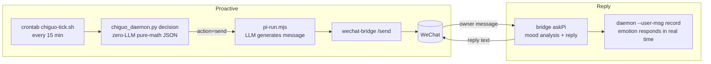

# Chiguo — Proactive AI Companion (迟菓主动消息系统)

[简体中文](README.md) | **English**

> The English version may lag behind; the Chinese version (README.md) is authoritative.

An AI character who proactively messages her owner: a zero-LLM math decision engine decides *when* to talk, in *what mood*, and *about what*; a model backend (pi-agent) turns each decision into a natural WeChat message.

**Chiguo** is a "proactive character messaging" system: the decision engine (`chiguo_daemon.py`) uses **emotion modeling, circadian sleep-window learning, trigger evaluation, and topic injection** to output structured JSON — never calling an LLM, never writing message text itself. pi-agent reads the JSON, generates the persona-flavored message, and wechat-bridge delivers it over WeChat.

- **Decision/generation separation**: the daemon never calls an LLM and never produces message text — only JSON
- **Zero-dependency core**: emotion decay, send gating, trigger evaluation, and topic selection all run locally on pure Python stdlib
- **Interpretable**: 13 trigger types, 5 emotion dimensions, 8 topic sources — every parameter tunable in `chiguo_proactive.toml`

## Table of Contents

- [Positioning](#positioning)
- [The Origin of Chiguo](#the-origin-of-chiguo)
- [Features](#features)
- [Architecture](#architecture)
- [Example Outputs](#example-outputs)
- [Quick Start](#quick-start)
- [Bring Your Own Model](#bring-your-own-model)
- [Configuration](#configuration)
- [Customizing the Persona](#customizing-the-persona)
- [Deploy as a Live Service](#deploy-as-a-live-service)
- [Project Layout](#project-layout)
- [CLI Reference](#cli-reference)
- [FAQ](#faq)
- [Contributing](#contributing)
- [Documentation](#documentation)
- [License](#license)

---

## Positioning

Chiguo is a **personal project shared as open source**: actively used by its author, evolving with personal needs, and not always "engineered" for public consumption. It is not a commercial product — no SLA, no API-stability promises. If it inspires you to build your own AI companion, that's the point.

### Component Dependencies

| Component | Required? | Degradation when missing |
|-----------|-----------|--------------------------|
| Python 3.14+ / uv | Required | — |
| pi-agent (model backend, any provider) | Required | Messages cannot be generated |
| wechat-bridge (WeChat bridge) | Optional | No WeChat delivery; daemon still runs via CLI |
| Memory system (pi extension memory-lancedb-pro + LanceDB store + ollama embedding + Python `lancedb` package) | Optional | Memory topic sources reduced (JSON fallback); `envcheck` reports a warning |
| NetEase Music bridge | Optional | Not configured/disabled → fully inactive (one fewer topic source) |
| Class schedule xlsx | Optional | Not configured/disabled → fully inactive (availability=1.0, treated as free) |

> ⚠️ **Privacy**: WeChat login state (`wechat-bridge/credentials/`), real conversation logs (`chiguo_messages.jsonl` / `chiguo_decisions.jsonl`), and personal data (`data/` schedule/memories/QR) are **never committed to git** — kept locally only (history was rewritten to purge them). Making the repo public requires no cleanup.
>
> **Privacy, honestly**: conversation and system-state data stay on this machine only (not in git, not pushed anywhere); the repo contains code, config, and docs. All computation is local; no third-party cloud services are involved (except model API and NetEase API calls).

---

## The Origin of Chiguo

Chiguo (Sunny Chih) comes from the Chinese galgame series *Tricolour Lovestory* by 绘恋企划屋 (HL-Galgame, Wuhan Shanybai Culture):

- **First appearance**: *Tricolour Lovestory* (2017, Steam) — the younger sister of Chi Yao, a tsundere middle-school girl.
- **As a leading character**: the official sequel *Tricolour Lovestory S* (*SunnyRain Lovestory*, 2020) — "a middle-school student near Shi'er High School who delivers takeout after class to help support her family, known as 'the part-time worker girl'."
- **This project**: another possible life for her — she moves into a VPS, a cyber body that keeps wondering when her 哥哥 (big brother) will reply.

Personality and speech style are aligned line-by-line with the sequel's script 《日光雨》 (*SunnyRain*, in-repo at `doc/日光雨.md`, 17,099 lines); `personality/SUN2.md` is the single authoritative persona definition.

**Compliance notice**: this project is a **fan re-imagining of an official IP** — not an official work, and unrelated to 绘恋企划屋 / Shanybai Culture. The script text is bundled with the repo for personal study and fan-community reference only; character and script copyrights belong to the original creators. If the rights holders object, the project will remove the relevant material upon notice.

---

## Features

| Feature | Description |
|---------|-------------|
| 5-dimension emotion engine | Loneliness / affection / anxiety / energy / tsundere, half-life decay, real-time response to replies |
| Circadian learning | Dual-schedule dual-bucket learning, dynamic quiet window (no late-night pings) |
| 13 trigger types | sigmoid weights + weighted randomness instead of hard thresholds |
| 8 topic sources | Schedule/holidays, memory recall, solar terms, anniversaries, weather, NetEase Music… |
| Music bidirectional linkage | Playback inside the sleep window disproves "asleep" + reverse-calibrates the circadian model |
| Bayesian user state | 6 states inferred online: chatting / browsing / busy / sleeping / away / needs care |
| Message composer | Intent × Cue × Vibe three-layer composition, persona-able style |
| Break/summer-winter modes | Holidays and semester breaks, manual or automatic switching |
| Structured monitoring | stats / alerts / health + standalone watchdog |
| Backend liveness detection | Real-traffic accounting + WeChat alert/recovery notices (zero extra calls) |

---

## Architecture

Two pipelines: **proactive sending** (daemon decides → pi generates → WeChat delivers) and **replying** (WeChat message → pi analyzes & replies → daemon records).



Inside the decision engine (`chiguo_daemon.py`, zero LLM):

```
chiguo_daemon.py (decision engine)
  ├─ emotion decay (half-life)
  ├─ send gating (quiet window / daily cap / min interval / energy / Bayesian sleep inference)
  ├─ trigger evaluation (13 sigmoid-weighted types + weighted randomness)
  ├─ topic injection (8 sources for ice-breaking)
  ├─ circadian learning (dual-schedule dual-bucket → dynamic quiet window)
  ├─ follow-up (pending topics resumed naturally)
  ├─ music bidirectional linkage (netease: playback in sleep window disproves sleeping)
  └─ output JSON → pi-agent generates message → wechat-bridge → WeChat
```

---

## Example Outputs

The following are **sanitized, fabricated examples** (not real conversations), showing the shape of the system's output.

Decision JSON (single `chiguo_daemon.py` run; msg_id/timestamp are fake):

```json
{
  "action": "send",
  "msg_id": "a1b2c3d4e5f6",
  "trigger": "lonely_mid",
  "intensity": "medium",
  "context": {
    "emotion": { "loneliness": 62, "affection": 58, "anxiety": 41, "energy": 73, "tsundere_index": 66 },
    "silent_hours": 6.2,
    "situation": "…He hasn't messaged me in a while."
  }
}
```

Example messages (generated in the `personality/SUN2.md` style — **examples, not real conversations**):

> **Daily care** (proactive, weather topic triggered): "…The forecast says it's getting cold tomorrow. Hmph, it's not like I care — I just don't want you freezing your brain off and leaving my messages unread. …Anyway. Wear a jacket."
>
> **Tsundere pushback** (哥哥: "go to bed early"): "…What's it to you when I sleep! It's not like I need sleep anyway. …You're the one up till all hours — hmph, stay up then. I was just saying."
>
> **Follow-up** (about a manga they discussed): "Did you ever get around to that manga, or what? …Don't— don't ask how I remember these things. I just… do."

---

## Quick Start

Requires **Python 3.14+** (managed by uv). The core has zero third-party dependencies (pure stdlib); memory/schedule enhancements are optional.

```bash
git clone <repo-url> && cd <repo-dir>

uv sync                              # core (zero deps); full features: uv sync --all-extras
uv run python chiguo_demo.py         # interactive demo (templates only, no LLM)
uv run python chiguo_daemon.py       # single decision → JSON
uv run python chiguo_daemon.py --status   # current state

# Core tests (full suite in AGENTS.md: 24 py + 9 script standalone runners)
uv run python test_chiguo_math.py && node test_pi_run.mjs
```

> Note: `uv sync` does not install lancedb by default (memory runs in JSON-fallback mode); `uv sync --all-extras` enables full memory and schedule parsing. Integration tests require `chiguo_proactive.toml` in the current directory — always run from the project root.

---

## Bring Your Own Model

All message generation and mood analysis go through **pi-agent**; the provider is decided by a single source — `[host].provider` in `chiguo_proactive.toml` (default example: opencode-go; any provider supported by pi works):

- **Built-in providers**: run `pi` interactively and `/login <provider>` to store the key in auth.json, or `export PI_API_KEY=... && bash scripts/install_pi.sh --yes`
- **Custom OpenAI-compatible endpoints**: write `~/.pi/agent/models.json` (pi's official mechanism — works with ollama / vLLM / self-hosted gateways)

```toml
[host]
provider = "openai"     # or deepseek / anthropic / google / a custom endpoint name…
model = "gpt-5"
```

Detailed steps: [doc/PI_INTEGRATION.md](doc/PI_INTEGRATION.md) §7 "接入任意模型 API" (Chinese).

---

## Configuration

All parameters live in `chiguo_proactive.toml` (314 lines, hot-reloaded in `--loop` mode) — no code changes needed:

```toml
[emotion]       # 5 emotion dimensions: loneliness/affection/anxiety/energy/tsundere (half-life decay)
[cooldown]      # send gating: quiet window / daily cap / min interval
[trigger]       # 13 trigger sigmoid weights
[schedule]      # class schedule (optional source: disabled or missing xlsx → treated as free)
[netease]       # NetEase (optional source: disabled or missing cookie → fully inactive)
[composer]      # message composition Intent × Cue × Vibe
[host]          # pi-agent backend: provider/model/thinking/session
[health]        # backend liveness threshold
```

Full configuration reference: [doc/SYSTEM.md](doc/SYSTEM.md) (Chinese).

---

## Customizing the Persona

The fun part — the persona is entirely text-defined and can be swapped wholesale:

```
personality/
├── SUN2.md                 # single authoritative persona definition (layers/identity/relations/boundaries)
├── 迟菓语言技巧指南.md      # speech-style manual (L1 tone words → L6 self-check) (Chinese)
├── tsundere.toml           # tsundere gear (current persona)
└── deredere.toml           # sweet gear (switchable)
```

Want a different character? Write your own `SUN2.md` (model it on the existing structure) and point `[host].personality_dir` at it.

---

## Deploy as a Live Service

```bash
bash deploy.sh   # install uv/Python 3.14 → create venv → full test → env check → pi env + wechat-bridge + cron
```

**Auth migration**: credentials live in `~/.chiguo/auth/` (WeChat login state / NetEase cookie / pi keys, mode 700, outside the repo). Moving to a new machine: copy that directory → run `deploy.sh` and everything hooks up automatically. pi keys migrate 100%; WeChat/NetEase web sessions may trigger an automatic re-login (QR scan) on a different device.

After deployment, the system runs on its own: crontab evaluates "should she message proactively?" every 15 minutes; the WeChat bridge stays online for your messages. Management commands:

```bash
bash scripts/wechat-bridge.sh status   # bridge status
bash scripts/wechat-bridge.sh login    # re-scan QR code to log in
tail -f logs/cron-tick.log             # proactive-send log
```

---

## Project Layout

```
chiguo_proactive.toml    # main config (all parameters)
chiguo_daemon.py         # decision engine (main entry, zero LLM)
chiguo_state.py          # emotion engine + persona + Bayesian + schedule + holidays + memory + circadian
chiguo_circadian.py      # circadian learning (dual-schedule buckets)
chiguo_trigger.py        # triggers (sigmoid weights + weighted randomness + follow-up)
chiguo_topics.py         # topic picker (8 sources + Ebbinghaus + persona modulation)
chiguo_math.py           # math library (sigmoid/half-life/Hawkes/probability accumulation)
chiguo_personality.py    # multi-dimension persona system (Big Five + 8 character-specific dims)
chiguo_bayesian.py       # Bayesian user-state inference (6 states, online learning)
chiguo_composer.py       # message composer (Intent × Cue × Vibe)
chiguo_eventbus.py       # lightweight event bus
netease_bridge.py        # NetEase bridge (recent plays + cache + bounded retry)
chiguo_netease.py        # NetEase strategy layer (health/degradation chain/quota/topic material)
schedule_parser.py       # schedule parser (xskb.xlsx → cache)
holiday_parser.py        # holiday detection
solar_terms.py           # 24 solar terms
memory_bridge.py         # LanceDB read-only bridge + Ebbinghaus forgetting (lancedb optional; JSON fallback)
anniversary_manager.py   # anniversary/countdown CRUD
chiguo_monitor.py        # structured monitoring (stats / alerts / health)
chiguo_watchdog.py       # standalone watchdog (stall detection)
chiguo_envcheck.py       # environment readiness check (read-only)
chiguo_version.py        # single source of project version (+0.1 per round)
chiguo_demo.py           # demo mode (templates only)
scripts/pi_health.py     # backend liveness state machine (real-traffic accounting + WeChat alerts)
scripts/pi-run.mjs       # unified pi invocation (generate/analyze)
scripts/chiguo-tick.sh   # system crontab entry (proactive-send pipeline)
scripts/install_pi.sh    # pi environment installer (dry-run/yes/ask, idempotent)
wechat-bridge/           # WeChat bridge (bridge.mjs + command-detect.mjs)
personality/             # persona files (SUN2.md + speech manual + gear tomls)
doc/                     # system docs (SYSTEM.md / PI_INTEGRATION.md / 日光雨 script)
test_*.py / test_*.mjs / test_*.sh   # tests (standalone runners)
data/                    # data files (schedule / manual memories / NetEase QR)
```

---

## CLI Reference

```bash
# Decision engine
uv run python chiguo_daemon.py                  # single decision
uv run python chiguo_daemon.py --status         # current state
uv run python chiguo_daemon.py --compact        # compact mode (for tick)
uv run python chiguo_daemon.py --version        # version number
uv run python chiguo_daemon.py --loop 120       # run continuously

# Owner messages
uv run python chiguo_daemon.py --user-msg "message"
uv run python chiguo_daemon.py --user-msg "message" --analysis '{"warmth":0.7,"effort":0.8,"attention":0.9}'

# Anniversary management
uv run python chiguo_daemon.py --anniversary "add anniversary 11-03 owner's birthday"
uv run python chiguo_daemon.py --anniversary "add countdown 2026-12-25 exam"
uv run python chiguo_daemon.py --anniversary list

# Break/semester modes
uv run python chiguo_daemon.py --break add 2026-01-12 2026-02-22 winter-break
uv run python chiguo_daemon.py --break on / off / status

# Health & monitoring
uv run python chiguo_daemon.py --health
uv run python chiguo_daemon.py --stats 30
uv run python chiguo_monitor.py --summary --health
uv run python chiguo_watchdog.py --quiet         # watchdog (exit-code driven)

# Environment readiness (read-only)
uv run python chiguo_envcheck.py                # exit codes: 0=ready 1=warning 2=critical
```

---

## FAQ

**Who is Chiguo? Any copyright issues?**
She originates from the official *Tricolour Lovestory* series (see [The Origin of Chiguo](#the-origin-of-chiguo)). This project is a fan re-imagining; the script is bundled for study reference only, copyrights belong to the original creators, and material will be removed on objection.

**What's the difference between installing the memory system or not?**
Without it (`uv sync`): memory topic sources are reduced, JSON fallback, `envcheck` reports a warning. With it (`uv sync --all-extras` + `bash scripts/install_pi.sh --yes`): full LanceDB memory + music linkage.

**How do I change the persona / personality?**
Edit the `personality/` directory — `SUN2.md` is the authoritative definition, the speech manual shapes tone, and a whole new character is just a new `SUN2.md`.

**Do I need to change code to switch models?**
No. Change `[host].provider` / `[host].model` in `chiguo_proactive.toml` and configure the key; custom OpenAI-compatible endpoints see [PI_INTEGRATION.md](doc/PI_INTEGRATION.md).

**Where is the data stored?**
Decision/conversation JSONL and system state stay on this machine only (never committed) + the LanceDB memory store at `~/.pi-agent/memory/lancedb-pro`. All computation is local.

**Why isn't she messaging me?**
Send gating is working: quiet window (late night), daily cap, min interval, trigger evaluation. `--status` / `--stats 30` shows what's blocking her.

**How do I log into WeChat?**
`bash scripts/wechat-bridge.sh login` and scan the QR code; the login state is kept locally only (never committed) — a fresh clone requires logging in again.

---

## Contributing

Any contribution is welcome — especially ones that help *her* grow:

- **Test-first (TDD)**: the repo rule is failing test → minimal implementation (red → green). Each `test_*.py` is a standalone runner, exit-code driven.
- **Run the full suite before submitting**: see `AGENTS.md` (24 py + 9 script tests), all green before commit.
- **Keep docs in sync**: any behavior change must update `doc/SYSTEM.md`, `doc/IMPROVE.md`, `MEMORY.md` (repo rule).
- **Commit style**: `feat:` / `fix:` / `docs:` / `chore:` prefix + Chinese description.
- **Design docs**: for major changes, write a design doc under `~/chiguo-meta/specs/` (outside the repo) and get it reviewed first.

---

## Documentation

- [doc/SYSTEM.md](doc/SYSTEM.md) — full system documentation: architecture, business logic, configuration reference (Chinese)
- [doc/PI_INTEGRATION.md](doc/PI_INTEGRATION.md) — pi-agent integration guide: model backend, WeChat bridge, deployment (Chinese)
- [doc/日光雨.md](doc/日光雨.md) — the official sequel script (persona reference) (Chinese)
- [doc/IMPROVE.md](doc/IMPROVE.md) — improvement log (Chinese)
- [doc/README.md](doc/README.md) — internal ops quick reference (Chinese)
- [AGENTS.md](AGENTS.md) / [CLAUDE.md](CLAUDE.md) — AI-assistant conventions, including the full test suite (Chinese)

---

## License

[MIT](LICENSE) © 2026 lhxyzCJ

Character and script copyrights belong to 绘恋企划屋 (HL-Galgame, Wuhan Shanybai Culture). This project is a fan re-imagining; it is not an official work.
