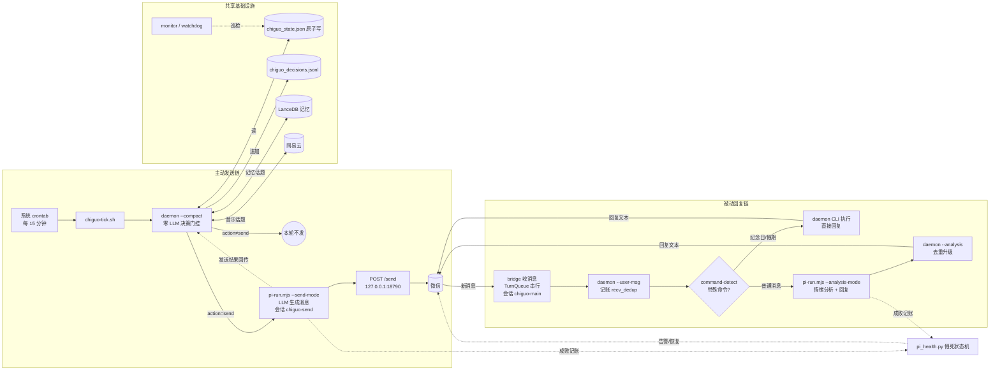

<div align="center">

# 🎀 Chiguo (迟菓)

**A role-play AI companion who proactively messages her user**

Zero-LLM math decision engine · LLM message generation · WeChat delivery

[](https://www.python.org/)
[](LICENSE)
[](doc/SYSTEM.md)
[](wechat-bridge/)
[](https://docs.astral.sh/uv/)

[简体中文](README.md) | **English**（The English version may lag behind; the Chinese version is authoritative.）

</div>

**Chiguo** is a role-play chat bot: a character from the Chinese galgame series *Tricolour Lovestory* (by 绘恋企划屋 / HL-Galgame). She proactively messages her user — a zero-LLM math decision engine decides *when* to reach out, *in what mood*, and *about what*; an LLM turns each decision into a tsundere WeChat message that fits her persona.

- **Decision/generation separation**: `chiguo_daemon.py` never calls an LLM and never writes message text — only structured JSON
- **Zero-dependency core**: emotion decay, send gating, trigger evaluation, and topic selection all run locally on pure Python stdlib
- **Interpretable**: 13 trigger types, 5 emotion dimensions, 8 topic sources — every parameter tunable in `chiguo_proactive.toml`, no code changes

## Table of Contents

- [🎀 Who Is She](#-who-is-she)
- [✨ Features](#-features)
- [🏗 Architecture](#-architecture)
- [💬 Example Outputs](#-example-outputs)
- [🚀 Quick Start](#-quick-start)
- [🧩 Components](#-components)
- [🧠 Bring Your Own Model](#-bring-your-own-model)
- [🎭 Customizing the Persona](#-customizing-the-persona)
- [🛠 Deploy & Ops](#-deploy--ops)
- [📖 Docs & Contributing](#-docs--contributing)
- [❓ FAQ](#-faq)
- [📁 Project Layout](#-project-layout)
- [📄 License](#-license)

---

## 🎀 Who Is She

Chiguo comes from the *Tricolour Lovestory* series (a Chinese galgame by 绘恋企划屋 / HL-Galgame); here she lives in a VPS — a cyber body that keeps wondering when her 哥哥 (big brother) will reply. Her personality and speech style are aligned line-by-line with the official sequel's script; `personality/SUN2.md` is the single authoritative persona definition.

> ⚠️ **Compliance notice**: this project is an **unofficial fan re-imagining of an official IP**, unrelated to 绘恋企划屋 / Shanybai Culture. The script text is bundled for personal study and fan-community reference only; character and script copyrights belong to the original creators. If the rights holders object, the project will remove the relevant material upon notice.
>
> 🔒 **Privacy**: WeChat login state, real conversation logs, and personal data (schedule/memories/QR codes) are **never committed to git** — kept on this machine only. All computation is local; no third-party cloud services are involved (except model API and NetEase API calls). Making the repo public requires no cleanup.

---

## ✨ Features

| Feature | Description |
|---------|-------------|
| 🧭 5-dimension emotion engine | Loneliness / affection / anxiety / energy / tsundere, half-life decay, real-time response to replies |
| 🌙 Circadian learning | Dual-schedule dual-bucket learning, dynamic quiet window (no late-night pings) |
| 🎯 13 trigger types | Sigmoid weights + weighted randomness instead of hard thresholds |
| 💡 8 topic sources | Schedule/holidays, memory recall, solar terms, anniversaries, weather, NetEase Music… |
| 🎵 Music bidirectional linkage | Playback inside the sleep window disproves "asleep" + reverse-calibrates the circadian model |
| 🧠 Bayesian user state | 6 states inferred online: chatting / browsing / busy / sleeping / away / needs care |
| ✍️ Message composer | Intent × Cue × Vibe three-layer composition, persona-able style |
| 🏖 Break/summer-winter modes | Holidays and semester breaks, manual or automatic switching |
| 📊 Structured monitoring | stats / alerts / health + standalone watchdog |
| 💗 Backend liveness detection | Real-traffic accounting + WeChat alert/recovery notices (zero extra calls) |

---

## 🏗 Architecture

The system is two message pipelines, all running locally — model API and NetEase API are the only external calls.

**Proactive sending**: a system crontab wakes `scripts/chiguo-tick.sh` every 15 minutes → runs `chiguo_daemon.py --compact` as a **zero-LLM decision gate** (emotion / gating / triggers / topics all computed locally) → if the decision is not `send`, it exits; otherwise `scripts/pi-run.mjs --send-mode` turns the decision JSON into WeChat text via the LLM (dedicated session `chiguo-send`) → HTTP POST to the bridge `/send` for delivery → the send result is reported back to the daemon (`--record-send`).

**Passive replying**: a WeChat message enters the bridge → `chiguo_daemon.py --user-msg` records it **deterministically** (real-time emotion response, recv_dedup against double-counting) → `command-detect.mjs` rules check first: **special commands** (anniversaries / holidays) are executed and answered directly, **no LLM**; ordinary messages go through `pi-run.mjs --analysis-mode`, producing "mood analysis JSON + reply text" in one call → the analysis is merged back into the daemon via `--analysis` (dedup upgrade) → the reply is sent back to WeChat. The reply side runs as a resident serial process (TurnQueue, session `chiguo-main`), zero session sharing with proactive sending.

**Shared & alerting**: daemon state is written atomically to `chiguo_state.json` (tmp→os.replace + checksum), decisions appended to `chiguo_decisions.jsonl`; memory (LanceDB) and the NetEase Music bridge feed topic inputs; `chiguo_monitor.py` / `chiguo_watchdog.py` patrol independently. Both pipelines record pi-call outcomes into the `pi_health.py` liveness state machine — when consecutive failures cross the threshold, it alerts via the WeChat bridge automatically, and notifies on recovery (zero extra LLM calls).



Inside the decision engine (`chiguo_daemon.py`, zero LLM):

```
emotion decay (half-life) → send gating (quiet window / caps / interval / energy / Bayesian sleep inference)
  → trigger evaluation (13 sigmoid + weighted randomness) → topic injection (8 sources for ice-breaking)
  → circadian learning (dual-schedule buckets → dynamic quiet window) → follow-up (pending topics)
  → music linkage (playback in sleep window disproves sleeping) → JSON output
```

---

## 💬 Example Outputs

> Sanitized, fabricated examples (not real conversations), showing the shape of the system's output.

Decision JSON (single `chiguo_daemon.py` run; msg_id/timestamp are fake):

```json
{
  "action": "send",
  "msg_id": "a1b2c3d4e5f6",
  "trigger": "lonely_mid",
  "intensity": "medium",
  "context": {
    "emotion": { "loneliness": 62, "affection": 58, "anxiety": 41, "energy": 73, "tsundere_index": 66 },
    "silent_hours": 6.2,
    "situation": "…He hasn't messaged me in a while."
  }
}
```

Example messages (generated in the `personality/SUN2.md` style — **examples, not real conversations**):

> **Daily care** (proactive, weather topic triggered): "…The forecast says it's getting cold tomorrow. Hmph, it's not like I care — I just don't want you freezing your brain off and leaving my messages unread. …Anyway. Wear a jacket."
>
> **Tsundere pushback** (哥哥: "go to bed early"): "…What's it to you when I sleep! It's not like I need sleep anyway. …You're the one up till all hours — hmph, stay up then. I was just saying."
>
> **Follow-up** (about a manga they discussed): "Did you ever get around to that manga, or what? …Don't— don't ask how I remember these things. I just… do."

---

## 🚀 Quick Start

Requires **Python 3.14+** (managed by uv). The core has zero third-party dependencies (pure stdlib); memory/schedule enhancements are optional.

```bash
git clone git@github.com:lhxyzCJ/chiguo.git && cd chiguo

uv sync                              # core (zero deps); full features: uv sync --all-extras
uv run python chiguo_demo.py         # interactive demo (templates only, no LLM)
uv run python chiguo_daemon.py       # single decision → JSON
uv run python chiguo_daemon.py --status   # current state

# Core tests (full suite: 24 py + 7 script standalone runners)
uv run python tests/test_chiguo_math.py && node tests/test_pi_run.mjs
```

> Note: `uv sync` does not install lancedb by default (memory runs in JSON-fallback mode); `uv sync --all-extras` enables full memory and schedule parsing. Integration tests require `chiguo_proactive.toml` in the current directory — always run from the project root.

---

## 🧩 Components

A complete Chiguo is assembled from the components below. Only two are essential — **Python** and the **model backend**; everything else is an optional enhancement that degrades gracefully.

### Python 3.14+ / uv

**Role**: the minimal runtime. The decision engine has zero third-party dependencies (pure stdlib); uv manages the interpreter and virtualenv so `uv run` behaves identically on any machine.

**Setup**: `deploy.sh` installs it automatically; manually: [docs.astral.sh/uv](https://docs.astral.sh/uv/).

**Missing**: nothing runs — it is the only truly required piece.

### pi-agent (model backend)

**Role**: all LLM capabilities come from here — proactive message generation, and reply mood analysis + reply text. Supports any provider (OpenAI / DeepSeek / Anthropic / self-hosted gateways…), decided by the single source `[host].provider` in `chiguo_proactive.toml`.

**Setup**: `export PI_API_KEY=... && bash scripts/install_pi.sh --yes`, or `pi` interactive `/login <provider>`. See [🧠 Bring Your Own Model](#-bring-your-own-model) and [doc/PI_INTEGRATION.md](doc/PI_INTEGRATION.md).

**Missing**: no messages can be generated — the decision engine still evaluates *whether* to send, but there is no LLM to produce the words.

### wechat-bridge (WeChat bridge)

**Role**: the last mile — actually delivers generated text to WeChat and receives the user's messages back for the daemon to record. Runs as a resident process; login state stays local (one QR scan).

**Setup**: `bash scripts/wechat-bridge.sh install`; login with `bash scripts/wechat-bridge.sh login`.

**Missing**: no WeChat delivery. The daemon still runs fine via CLI (`chiguo_daemon.py`) — decisions, emotions and accounting all work, messages just cannot be sent.

### Memory system (LanceDB + ollama embedding)

**Role**: Chiguo's long-term memory — "remembering" that outlasts mood. Worth-keeping bits of conversation are auto-accumulated into the memory store by the pi-agent memory-lancedb-pro extension (memories, old stories, your preferences); the decision engine recalls them **read-only** through `memory_bridge.py` (BM25 full-text search, zero tokens, zero extra calls), as one of the 8 topic sources: random old-story floats and memory injection into trigger context. Recall is weighted by an **Ebbinghaus forgetting curve** — older memories weigh less but never fully vanish (floor weight 0.1); `importance` filters out irrelevant rows. If the store is unavailable, probing retries every 60s, self-healing after recovery.

**Setup**: `uv sync --all-extras` + `bash scripts/install_pi.sh --yes` (initializes the memory store). The store lives at `~/.pi-agent/memory/lancedb-pro` (read-only from Chiguo's side; writes are done by the pi extension); `data/chiguo_memories.json` is the manual memory file, **always active** as a supplement.

**Missing**: graceful degradation when LanceDB is unavailable (`available=False`, queries return empty, no exceptions) — memory topic sources shrink and `chiguo_envcheck.py` reports a warn (non-fatal); manual JSON memories are unaffected. Differences in detail: [❓ FAQ](#-faq).

### NetEase Music bridge

**Role**: music linkage — playback inside the sleep window disproves "asleep" and reverse-calibrates the circadian model, and provides music topics.

**Setup**: guided during `install_pi.sh` (QR login to NetEase).

**Missing**: fully inactive — one fewer topic source, everything else unchanged.

### Class schedule xlsx

**Role**: lets Chiguo know when the user is in class — in-class/full-day schedules adjust emotion decay and trigger weights, and class info is injected into the trigger context.

**Setup**: drop the schedule Excel file into `data/` (file name and format per `chiguo_proactive.toml`).

**Missing**: treated as free time (availability=1.0) — conservative but safe.

---

## 🧠 Bring Your Own Model

All message generation and mood analysis go through **pi-agent**; the provider is decided by a single source — `[host].provider` in `chiguo_proactive.toml` (default example: opencode-go; any provider supported by pi works):

- **Built-in providers**: run `pi` interactively and `/login <provider>` to store the key in auth.json, or `export PI_API_KEY=... && bash scripts/install_pi.sh --yes`
- **Custom OpenAI-compatible endpoints**: write `~/.pi/agent/models.json` (pi's official mechanism — works with ollama / vLLM / self-hosted gateways)

```toml
[host]
provider = "openai"     # or deepseek / anthropic / google / a custom endpoint name…
model = "gpt-5"
```

Detailed steps: [doc/PI_INTEGRATION.md](doc/PI_INTEGRATION.md) §7 "接入任意模型 API" (Chinese).

---

## 🎭 Customizing the Persona

The fun part — the persona is entirely text-defined and can be swapped wholesale:

```
personality/
├── SUN2.md                 # single authoritative persona definition (layers/identity/relations/boundaries)
├── 迟菓语言技巧指南.md      # speech-style manual (L1 tone words → L6 self-check) (Chinese)
├── tsundere.toml           # tsundere gear (current persona)
└── deredere.toml           # sweet gear (switchable)
```

Want a different character? Write your own `SUN2.md` (model it on the existing structure) and point `[host].personality_dir` at it. All parameters live in `chiguo_proactive.toml` (314 lines, hot-reloaded in `--loop` mode) — no code changes needed.

---

## 🛠 Deploy & Ops

```bash
bash deploy.sh   # install uv/Python 3.14 → create venv → full test → env check → pi env + wechat-bridge + cron
```

**Auth migration**: credentials live in `~/.chiguo/auth/` (WeChat login state / NetEase cookie / pi keys, mode 700, outside the repo). Moving to a new machine: copy that directory → run `deploy.sh` and everything hooks up automatically. pi keys migrate 100%; WeChat/NetEase web sessions may trigger an automatic re-login (QR scan) on a different device.

After deployment, the system runs on its own: crontab evaluates "should she message proactively?" every 15 minutes; the WeChat bridge stays online for your messages.

```bash
bash scripts/wechat-bridge.sh status   # bridge status
bash scripts/wechat-bridge.sh login    # re-scan QR code to log in
tail -f logs/cron-tick.log             # proactive-send log

uv run python chiguo_daemon.py --health        # health check
uv run python chiguo_daemon.py --stats 30      # last 30 days stats
uv run python chiguo_envcheck.py               # env readiness (0=ready 1=warning 2=critical)
```

Full CLI reference: [doc/SYSTEM.md §7 CLI Reference](doc/SYSTEM.md#七cli-参考) (Chinese).

---

## 📖 Docs & Contributing

| Doc | Description |
|-----|-------------|
| [doc/SYSTEM.md](doc/SYSTEM.md) | Full system documentation: architecture, business logic, config reference, CLI, file list (Chinese) |
| [doc/PI_INTEGRATION.md](doc/PI_INTEGRATION.md) | pi-agent integration guide: model backend, WeChat bridge, deployment (Chinese) |
| [doc/日光雨.md](doc/日光雨.md) | The official sequel script (persona reference) (Chinese) |
| [AGENTS.md](AGENTS.md) | AI-assistant conventions, including the full test suite (Chinese) |

Any contribution is welcome — especially ones that help *her* grow:

- **Test-first (TDD)**: the repo rule is failing test → minimal implementation (red → green). Each `test_*.py` in `tests/` is a standalone runner, exit-code driven.
- **Run the full suite before submitting**: see `AGENTS.md` (24 py + 7 script tests), all green before commit.
- **Keep docs in sync**: any behavior change must update `doc/SYSTEM.md` (repo rule).
- **Commit style**: `feat:` / `fix:` / `docs:` / `chore:` prefix + Chinese description.
- **Design docs**: for major changes, write a design doc under `~/chiguo-meta/specs/` (outside the repo) and get it reviewed first.

---

## ❓ FAQ

**Who is Chiguo? Any copyright issues?**
She originates from the official *Tricolour Lovestory* series (see [🎀 Who Is She](#-who-is-she)). This project is a fan re-imagining; the script is bundled for study reference only, copyrights belong to the original creators, and material will be removed on objection.

**What's the difference between installing the memory system or not?**
Without it (`uv sync`): memory topic sources are reduced, JSON fallback, `envcheck` reports a warning. With it (`uv sync --all-extras` + `bash scripts/install_pi.sh --yes`): full LanceDB memory + music linkage.

**How do I change the persona / personality?**
Edit the `personality/` directory — `SUN2.md` is the authoritative definition, the speech manual shapes tone, and a whole new character is just a new `SUN2.md`.

**Do I need to change code to switch models?**
No. Change `[host].provider` / `[host].model` in `chiguo_proactive.toml` and configure the key; custom OpenAI-compatible endpoints see [PI_INTEGRATION.md](doc/PI_INTEGRATION.md).

**Where is the data stored?**
Decision/conversation JSONL and system state stay on this machine only (never committed) + the LanceDB memory store at `~/.pi-agent/memory/lancedb-pro`. All computation is local.

**Why isn't she messaging me?**
Send gating is working: quiet window (late night), daily cap, min interval, trigger evaluation. `--status` / `--stats 30` shows what's blocking her.

**How do I log into WeChat?**
`bash scripts/wechat-bridge.sh login` and scan the QR code; the login state is kept locally only (never committed) — a fresh clone requires logging in again.

---

## 📁 Project Layout

```
chiguo_proactive.toml    # main config (all parameters, hot-reloaded)
chiguo_daemon.py         # decision engine (main entry, zero LLM)
chiguo_state.py          # emotion engine + persona + Bayesian + schedule/holidays/memory + circadian
scripts/                 # tick entry / pi wrapper / env installer / liveness detection
wechat-bridge/           # WeChat bridge (bridge.mjs + command-detect.mjs)
personality/             # persona files (SUN2.md + speech manual + gear tomls)
doc/                     # system docs (SYSTEM.md / PI_INTEGRATION.md / 日光雨 script)
tests/                   # tests (standalone runners)
data/                    # data files (schedule / memories / NetEase QR, never committed)
```

Detailed list: [doc/SYSTEM.md §6 File List](doc/SYSTEM.md#六文件清单) (Chinese).

---

## 📄 License

[MIT](LICENSE) © 2026 lhxyzCJ

Character and script copyrights belong to 绘恋企划屋 (HL-Galgame, Wuhan Shanybai Culture). This project is a fan re-imagining; it is not an official work.
